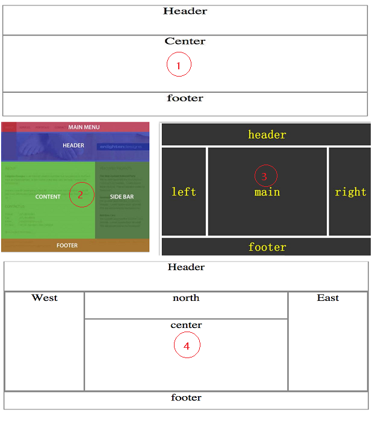

## 认识HTML

    html是超文本标记语言:
    	目前最新版本是html5,由w3c(万维网联盟)完成标准制定
    	
    何为超文本?    
    	文本只是单纯的显示字符串,超文本还可以显示音频,视频,图片,对内容可以有不同样式的调整,即是超文本.
    	
    发展历史:
        ①HTML 1.0：在1993年6月作为互联网工程工作小组(IETF)工作草案发布。    
        ②HTML 2.0：1995年1 1月作为RFC 1866发布，于2000年6月发布之后被宣布已经过时。     
        ③HTML 3.2：1997年1月14日，W3C推荐标准。     
        ④HTML 4.0：1997年12月18日，W3C推荐标准。    
        ⑤HTML 4.01（微小改进）：1999年12月24日，W3C推荐标准。    
        ⑥HTML 5：HTML5是公认的下一代Web语言,是HTML最新的修订版本，    
        2014年10月由W3C(制定Web技术标准的机构)制定。
        
    html如何识别?
    	html超文本标记语言,在b/s架构的服务中,利用http超文本传输协议,让浏览器进行解析,http独占80端口.
    	http:  超文本传输协议 (对html标记语言,传输解析的标准)
    	https: 加密版超文本传输协议 443
    	浏览器: 超文本的解析器

## HTML常见页面布局结构

## HTML常见标签
	font,meta,br,hr,pre,h1~h6,sub,p,strong,em
	sub,sup,div,span,ul,ol,dl,a,img,
	table,form,input,iframe

## HTML标签种类

    块状元素: 独占一行,可直接设置宽高
    	例如:<h1>~<h6>,
,
,<ul>,<ol>,<dl>,<li>,<table>,<form> ..
    行内元素: 不能独占一行,不能直接设置宽高
    	例如:,<a>,<label>,<input>,,<strong>,<em>
    行内块状元素: 不能独占一行,可直接设置宽高
    	例如:,<button>,<input>
## HTML语法特征

    1.内容不区分大小写
    2.标签结构分为单闭合、双闭合标签(标签成对显示)
    3.一个及多个空白符,都会被理解成一个空白符

## 表单属性
    placeholder  灰色输入提示
    required     必填
    readonly     只能读不能改   可以被提交
    disabled     只能读不能改   不会被提交
    size         设置输入框的大小
    maxlength    输入框最多可以输入多少字符
    minlength    输入框最少需要输入多少字符
    autofocus    自动获取焦点, 整个页面只能有一个
    tabindex     设置tab的切换顺序