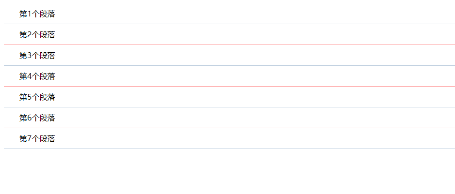
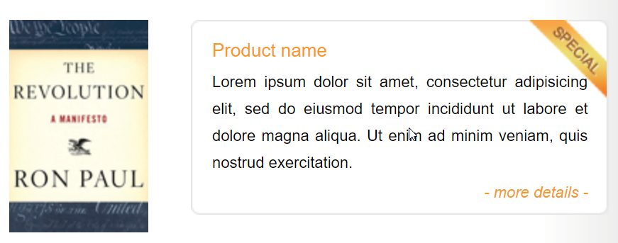
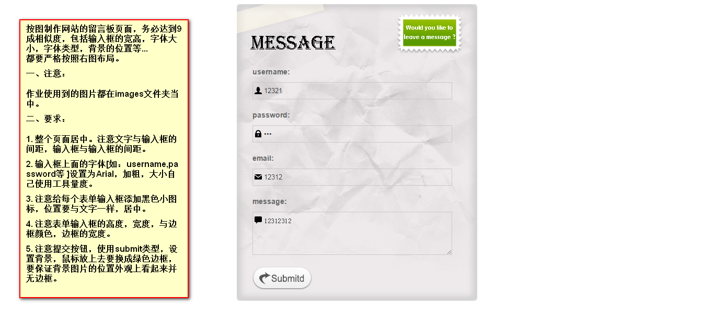

# 必做题

### 作业1

参考下图在`作业1.html`的页面结构基础上增加样式。

>要求：
>
>1. 不能修改现有的html代码结构，不能增加额外的html属性，使用合理的选择符给元素增加样式
>2. 注意给元素增加文本对齐，字体颜色，外边距和行高。
>3. 使用外部样式来完成本次作业

### 作业2

参考下图在`作业2.html`的页面结构基础上增加样式。

>要求：
>
>1. 图片圆角12px，宽度200px，左外边距10px，所有图片居中排列显示。

### 作业3

> 要求：
>
> 1. 根据课堂上讲解的隔行换色效果，对每一个li进行下边框的隔行换色处理
>
> 2. 每个li设置样式根据下图所述，高度和行高设置为42px，奇数行边框为`#bcd`，偶数行边框为`f99`。
>
>    首行缩进32像素。
>
> 3. 根据`作业3.html`中代码注释要求，查找手册，找到对应的样式补充代码。

# 选做题

### 作业4

根据以下图片，查找手册完成对应的样式效果。

>  要求：
>
> 1. 完成图片排版效果，查询手册找到float属性的使用，让图片元素浮动到左边，让右边内容整体浮动到右边。
> 2. 图片可以在image目录下找到.
> 3. 最外层背景渐变效果不用处理.
> 4. 文本字体颜色为黑色和`#f8981d`，边框为1像素宽度，边框为实线，颜色为`#6F605A`.
> 5. special图片采用定位属性来完成。

### 作业5

根据下图要求，查询手册完成对应的外观效果。

> 提示：
>
> 1. 表单各个输入框背景透明，每个边框左边的ico小图标采用图片定位方式不平铺.
> 2. 提交按钮，使用伪类属性来完成。