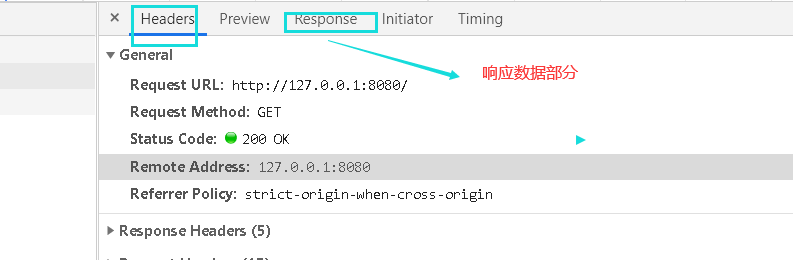
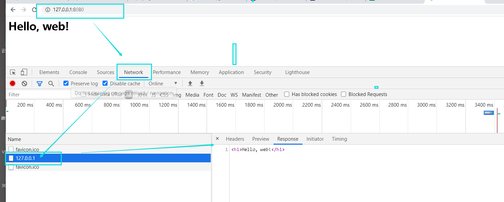
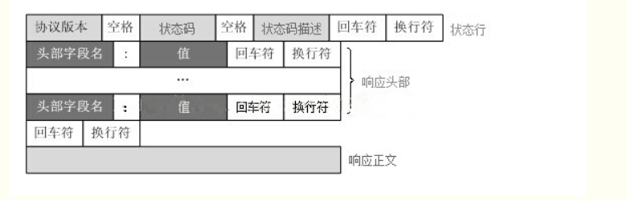
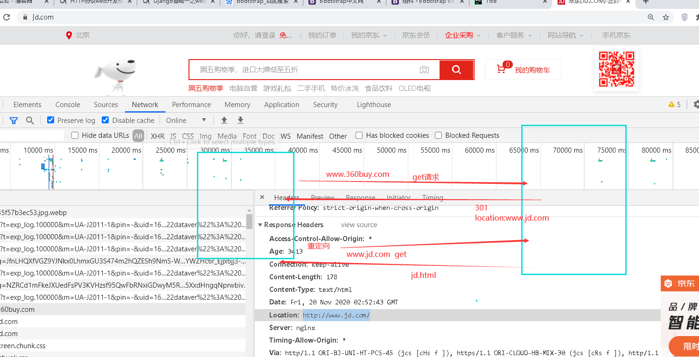
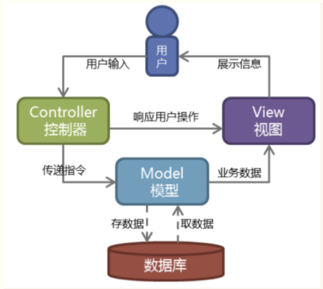
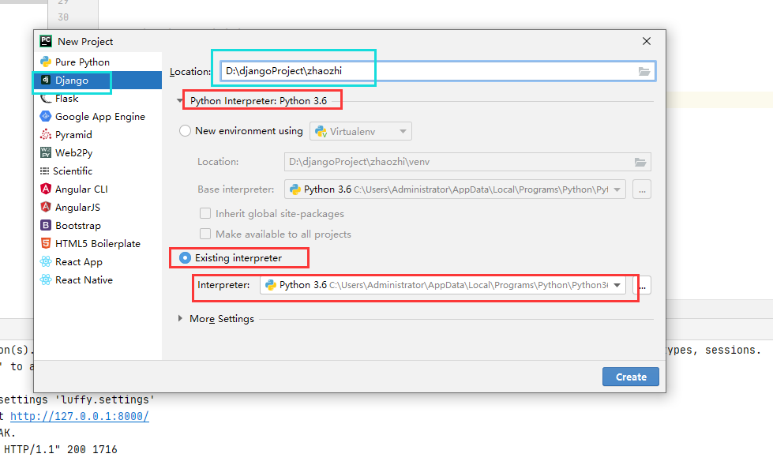

# 自定义web框架

1.urls.py文件,路径和要执行的函数的对应关系
```python
import views

urlpatterns = [
	# ('/', views.html),
	# ('/xx.css', views.css),
	# ('/1.jpg', views.jpg),
	# ('/xx.js', views.js),
	# ('/person', views.person),
	('/index', views.index),
]
```

2.views.py文件,写逻辑
```python
def index():
	with open('templates/index.html', 'rb') as f:
		data = f.read()
	return data
	# conn.send()
	# conn.close()
```

3.manage.py文件,是项目的入口
```python
import sys
from wsgi import run
from models import create_model

# python manage.py xx xx2
# 执行py文件时,后面携带的参数,可以通过py文件中的sys模块的sys.argv这个属性拿到,是个列表,列表第一项是文件名称,第二项之后,都是携带的参数
commands = sys.argv # xx xx2
# ['manage.py', 'xx', 'oo']


# 运行项目的指令: python manage.py runserver
# 数据库同步指令: python manage.py migrate
a1 = commands[1]
if a1 == 'runserver':
	run()
elif a1 == 'migrate':
	create_model()
```

4.wsgi.py文件,封装socket,接受请求,发送响应
```python
import time
from threading import Thread
from wsgiref.simple_server import make_server
from urls import urlpatterns

def run():
	def application(environ, start_response):
		'''
		:param environ: 是全部加工好的请求信息，加工成了一个字典，通过字典取值的方式就能拿到很多你想要拿到的信息
		:param start_response: 帮你封装响应信息的（响应行和响应头），注意下面的参数
		:return:
		'''
		start_response('200 OK', [])
		path = environ['PATH_INFO']
		for item in urlpatterns:
			if item[0] == path:
				t = Thread(target=item[1],args=(conn,))
				t.start()
				data = item[1]()
				break
		else:
			data = b'page no found!'
		return [data]

httpd = make_server('127.0.0.1', 8080, application)
print('Serving HTTP on port 8080...')
httpd.serve_forever()
```

5.models.py文件,用来建表
```python
import pymysql

def create_model():

	conn = pymysql.connect(
		host='127.0.0.1',
		port=3306,
		user='root',
		password='',
		database='nbweb',
		charset='utf8'
	)
	cursor = conn.cursor()

	sql = 'create table userinfo(id int primary key auto_increment, name char(10) not null, age int unsigned);'
	cursor.execute(sql)
	conn.commit()

	conn.close()
```

总结:
```text
1. 运行项目
2. 接受请求,wsgiref模块
	a. wsgiref模块将请求信息封装为一个字典,然后将字典传给了application函数,并执行该函数
	b. application函数中完成了不同路径找到不同的视图函数来执行,并获取视图函数的返回值,返回值为文件字节数据
	c. application函数返回列表数据,列表中视图函数的返回值
	d. wsgiref模块的make_server类的内部源码中将application函数的返回值,通过socket发送给了浏览器
```


# HTTP协议

名称:超文本传输协议(Hypertext Transfer Protocol,缩写HTTP)
版本1.1,目前已有2.0版本,只不过没有广泛应用
http协议是基于TCP/IP协议至上的应用层协议,分为两步:请求和响应

请求和响应的步骤
```text
例如:在浏览器地址栏输入URL,按下回车之后会经历以下流程

1.浏览器向DNS服务器请求解析该URL中的域名所对应的IP地址;
2.解析出IP地址后,根据IP地址和默认端口80,和服务器建立TCP链接;
3.浏览器发出读取文件(URL中域名后面部分对应的文件)的HTTP请求,该请求报文作为TCP三次握手的第三个报文的数据发送给服务器;
4.服务器对浏览器做出响应,并把对应的html文本发送给浏览器;
5.释放TCP链接;
6.浏览器显示该html内容;
```

```python
GET /1.jpg HTTP/1.1
Host: 127.0.0.1:8001
Connection: keep-alive
sec-ch-ua: "Chromium";v="86", "\"Not\\A;Brand";v="99", "Google Chrome";v="86"
sec-ch-ua-mobile: ?0
User-Agent: Mozilla/5.0 (Windows NT 10.0; Win64; x64) AppleWebKit/537.36 (KHTML, like Gecko) Chrome/86.0.4240.111 Safari/537.36
Accept: image/avif,image/webp,image/apng,image/*,*/*;q=0.8
Sec-Fetch-Site: same-origin
Sec-Fetch-Mode: no-cors
Sec-Fetch-Dest: image
Referer: http://127.0.0.1:8001/
Accept-Encoding: gzip, deflate, br
Accept-Language: zh-CN,zh;q=0.9
```

请求消息格式:


请求数据说明:GET请求方法的请求数据在请求的URL地址部分,POST请求携带的数据在请求数据部分.

请求头键值对:
```text
	USER-AGENT:chorme....   客户代理程序信息
​	HOST: 请求的服务端地址
​	Accept: 客户端可以接受的数据类型
```

get请求
```text
1.浏览器输入网址回车,就是get请求方法
2.a标签,href='https://www.baidu.com' 也是get请求方法
```

post请求
```text
提交数据
1.form表单标签中用户输入的内容,点击提交按钮,一般都是用post请求
	form标签,action='路由' method='post',默认是get
```

get和post的简单区别
```python
1.GET提交的数据会放在URL之后,也就是请求行里面,以?分割URL和传输数据,参数之间以&相连,例如EditBook?name=test1&id=123456,POST方法是把提交的数据放在HTTP包的请求数据部分;
2.GET提交的数据大小有限制(因为浏览器对URL的长度有限制),而POST方法提交的数据没有限制;
3.POST的数据不在URL上面显示,所以看着安全一些.
```

network中看到的内容解释
```python
General部分

Request URL: http://127.0.0.1:8080/   请求地址
Request Method: GET   请求方法
Status Code: 200 OK   响应状态码和描述
Remote Address: 127.0.0.1:8080    客户端的地址(ip+port)
        
request headers 请求头部键值对信息
response headers  响应头部键值对信息
```



查看network的步骤



响应信息格式



重定向的大致过程



状态码
```text
2xx 成功-请求已成功被服务器接收,理解,并接受 
3xx 重定向-需要后续操作才能完成这一请求
4xx 请求错误-请求含有语法错误或者无法被执行
5xx 服务器错误-服务器在处理某个正确请求时发生错误
```

URL: 统一资源定位符
```python
超文本传输协议(HTTP)的统一资源定位符将从因特网获取信息的五个基本元素包括在一个简单的地址中:
1.传输协议	HTTP/HTTPS...
2.层级URL标记符号(为[//],固定不变)
3.服务器(通常为域名,有时为IP地址)
4.端口号(以数字方式表示,若为HTTP的默认值80可省略)
5.路径(以"/"字符区别路径中的每一个目录名称)
6.查询参数(GET模式的参数,以"?"字符为起点,每个参数以"&"隔开,再以"="分开参数名称与数据)
例:https://www.cnblogs.com/clschao/articles/9230431.html?a=1&b=2
```


# 模版渲染

jinja2模块简单使用
```python
pip3 install jinja2
```

使用:
视图函数中的写法
```python

from jinja2 import Template

def html():
	with open('beatfulpage.html', 'r', encoding=utf-8) as f:
		data = f.read()
	temlpate = Template(data)
	ret = template.rander({"name": "于谦", "hobby_list":["烫头", "泡吧"]})
	data = ret.encode()
	return data
```

HTML文件中的语法
```html
<h1>{{name}}</h1>
<ul>
	
	<li>{{i}}</li>
	
</ul>
```


# MVC和MTV模式

MVC
	web服务器开发领域里著名的MVC模式,所谓MVC就是把WEB应用分为模型(M),控制器(C)和视图(V)三层,他们之间以一种插件式的\松耦合的方式连接在一起.

	

django是MTV模式,其实就是从MVC模式加工过来的
```python
M 代表模型(Model):负责业务对象和数据库的关系映射(ORM)
T 代表模版(Template):负责如何把页面展示给用户(html),模版渲染功能
V 代表视图(View):负责业务逻辑,并在适当时候调用Model和Template

+ url控制器 urls.py文件:路径和视图函数的映射关系
```

django下载安装
```shell
pip install django==1.11.9
```

创建项目

指令创建
```python
django=admin startproject luffy(项目名称)
```

创建应用
```shell
python manage.py startapp piao(应用app名称)
```

在项目的settings.py文件中修改
```python
INSTALLED_APPS = [
	'django.contrib.admin',
    'django.contrib.auth',
    'django.contrib.contenttypes',
    'django.contrib.sessions',
    'django.contrib.messages',
    'django.contrib.staticfiles',
    # 'piao',	# 加上应用名称
    'piao.apps.PiaoConfig'	# 两种写法都可以
]
```

pycharm创建django项目



在more settings的地方可以创建一个初始的应用


完成一个简单的web项目

1.urls.py文件中设置路径和函数的对应关系
```python
from django.conf.urls import url
from django.contrib import admin
from piao import views

urlpatterns = [
	url(r'^admin/', admin.site.urls),
	url(r'^home/', views.home)
]
```

2.在views.py文件中写视图函数
```python
from django.shortcuts import render

# Create your views here.

# envrion字典加工成了一个对象
# wsgirequest类对象
# class USGIRequest:
# 	def __init__(self):
# 		self.path = environ['PATH_INFO']
# 		self.path = environ['PATH_INFO']
# 		self.path = environ['PATH_INFO']
# 		self.path = environ['PATH_INFO']

def home(request):	# 参数名称业内一般都写成request
	print(request.path)		# 当前请求路径
	current_user = '招致'
	ret = rander(request, 'home.html', {"username": current_user})
	return ret
```

3.在templates文件夹中创建一个home.html文件,内容如下
```html
<!DOCTYPE html>
<html lang="en">
<head>
    <meta charset="UTF-8">
    <title>Title</title>
    <meta name="viewport" content="width=device-width, initial-scale=1">
</head>
<body>

<h1>欢迎尊贵的{{ username }}至尊会员,来到32期spa会所</h1>

</body>
</html>
```

注意:在settings.py文件中加上如下配置
```python
TEMPLATES = [
    {
        'BACKEND': 'django.template.backends.django.DjangoTemplates',
        # 'DIRS': os.path.join(BASE_DIR , 'templates'),
        'DIRS': [BASE_DIR , 'templates'],  #注意这个配置
        'APP_DIRS': True,
        'OPTIONS': {
            'context_processors': [
                'django.template.context_processors.debug',
                'django.template.context_processors.request',
                'django.contrib.auth.context_processors.auth',
                'django.contrib.messages.context_processors.messages',
            ],
        },
    },
]
```


# 作业
```python
# 用户登录
# 1 get请求回复登录页面
# 2 用户输入用户名和密码提交post请求到后台
# 3 后台将用户提交过来的数据取出,并判断用户名和密码是否正确,  username='root'  password='123'
# 4 用户名密码都是对的,回复一个新的html页面,  失败了,回复一个含有404字符串的页面
```


