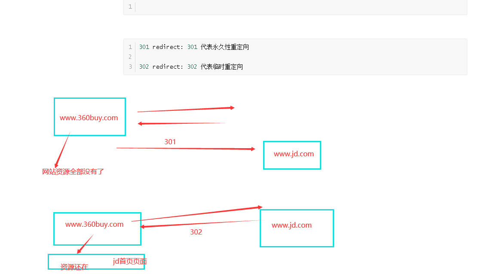
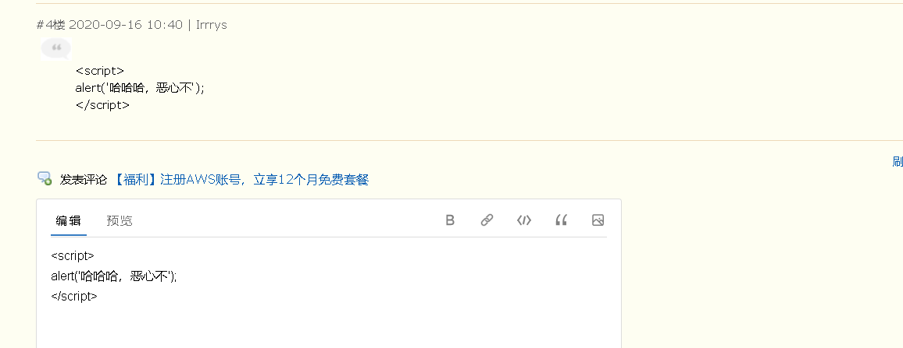

## 作业讲解

注意:发送post请求时,要先将settings.py文件中的某个配置注释掉
```python
MIDDLEWARE = [
    'django.middleware.security.SecurityMiddleware',
    'django.contrib.sessions.middleware.SessionMiddleware',
    'django.middleware.common.CommonMiddleware',
    # 'django.middleware.csrf.CsrfViewMiddleware',
    'django.contrib.auth.middleware.AuthenticationMiddleware',
    'django.contrib.messages.middleware.MessageMiddleware',
    'django.middleware.clickjacking.XFrameOptionsMiddleware',
]
```

urls.py
```python
from django.contrib import admin
from django.conf.urls import url
from app01 import views

urlpatterns = [
	url('^admin/', admin.site.urls),
	url('^login3/', views.login3)
]
```

views.py
```python
def login(request):
	return render(request, 'login.html')

# post请求提交的数据,通过request.POST来获取
# get或者post,当请求url中含有查询参数时,要在后台的request对象中获取查询参数,用的属性为request.GET
# http://127.0.0.1:8001/login/?a=1&b=2

def login2(request):
	print(request.POST)	  # <QueryDict: {'username': ['chao'], 'password': ['123']}>
	uname = request.POST.get('username')
	pwd = request.POST.get('password')
	# print(uname, pwd)
	if uname == "root" and pwd == "123":
		return render(request, 'home.html', {'username': uname})
	else:
		return render(request, '404.html')
	# HttpResponse 回复普通字符串
	# render 回复html页面
	# return HttpResponse('ok')

# 合并版
def login3(request):
	print(request.method)	# 获取当前请求的请求方法,大写的
	if request.method == 'GET':
		return render(request, 'login.html')
	else:
		uname = request.POST.get('username')
		pwd = request.POST.get('password')
		# print(uname, pwd)
		if uname == 'root' and pwd == '123':
			return render(request, 'home.html', {'username': uname})
		else:
			return render(request, '404.html')
```

login.html
```html
<form action="/login3/" method="post">	  <!-- 提交数据时自动拼接上网址,不带路径 -->
	用户名: <input type="text" name="username">
	密码: <input type="password" name="password">
	<input type="submit">
	<button>提交</button>
</form>
```


## url

1.写url时需要注意的点:
```python
# 路径的前置导航斜杠(对应根路径的那个),不要写,django会自动加上
url(r'^index/', views.index)

# 当我们访问django的url路径时,如果请求路径最后没有写/,那么django会发一个重定向的响应,告诉浏览器,加上/再来访问我	  
http://127.0.0.1:8000/index

# settings.py配置文件中修改:
# APPEND_SLASH = True	# 默认为True,当值为True时,django需要请求路径后面加上斜杠,如果请求没有加,那么响应301重定向,让浏览器加上斜杠重新请求
# 当值为False,就关闭了django的这个功能
# APPEND_SLASH = False

url(r'^index/$', views.index)	# /index/
url(r'^index/xx/xx/', views.index2)	  # /index/2018/07
#注意:路径写正则时,要注意最好精确匹配,尾部加上$,或者写正则时,尽量不要路径差不多
url(r'^$', views.home)	 # 匹配根路径的写法
```

2.url分组
```python
无名分组: 位置参数,注意参数位置固定
	# urls.py写法
	url(r'^book/(\d+)/(\d+)/', views.books)
	# 视图函数写法:
	def books(request, x, y):
		print(x, y)	  # 2019 07 匹配出来的都是字符串
		return HttpResponse("%s-%s所有书籍都在这儿,你随意看" % (x, y))

有名分组: 关键字参数,函数参数必须和有名分组的名称相同,不在乎参数位置
	# urls.py写法
	url(r'^books/(?P<year>\d+)/(?P<month>\d+)/', views.books2)
	# 视图函数写法
	def books2(request, month, year):
		print(year, month)	# 2019 07 匹配出来的都是字符串
		return HttpResponse("%s-%s所有书籍都在这,你随意看" % (year, month))
```


## 视图部分

1.request的常用属性
```python
def login(request):
	print(request)	# <WSGIRequest: GET '/login/?a=1&b=2'> WSGIRequest类的实例化对象
	print(request.method)
	print(request.POST)
	print(request.GET)	# request.GET.get('a')	== 1
	print(request.path)	 # 获取当前请求路径
	print(request.get_full_path())	# 获取当前请求路径包含查询参数
	print(request.META)	 # 获取所有请求头信息 {'HTTP_USER_AGENT':'asdfasdfasdf',....}
	# request.META 字典类型数据,所有的请求头的键都加上一个HTTP_的键名称
	return HttpResponse('ok')
```

2.response的三个响应方法:
```python
# HttpResponse	# 响应字符串,默认的响应状态码为200
# render	# 响应页面,默认的响应状态码为200
# redirect	# 重定向,默认的响应状态码是302
```

```python
# 301 redirect: 301 代表永久性重定向
# 302 redirect: 302 代表临时重定向
```


3.redirect响应

示例:
```python
def login(request):
	if request.method == "GET":
		return render(request, 'login.html')
	else:
		uname = request.POST.get('username')
		if uname == 'shiyuan':
			# redirect的参数为一个路径
			return redirect('/home/')

def home(request):
	book = '金瓶梅'
	return render(request, 'home.html', {'book': book})
```

4.设置响应头和状态码
```python
def index(request):
	re = HttpResponse('xxx')
	# re = render(request, 'xxx.html')
	# re = redirect('/home/')
	re['name'] = 'gaodao'	# 添加响应头键值对
	# HttpResponse setattr
	re.status_code = 404	# 修改状态码
	return re
```


## CBV和FBV

FBV (function base views): 就是在视图里使用函数处理请求
CBV (class base views): 就是在视图里使用类处理请求

1.写视图逻辑的两种方式

a.方式一:
urls.py文件的写法
```python
urlpatterns = [
	url(r'^book/', views.BookView.as_view())
]
```

视图部分的写法
```python
from django.views import view

class BookView(View):
	# 通过反射获取到请求方法对应的类中的方法来执行
	def get(self, request):
		return HttpResponse('ok')
	# 需要处理什么请求方法,就写对应名称的方法
```

源码部分
```python
def dispatch(self, request, *args, **kwargs):
    # Try to dispatch to the right method; if a method doesn't exist,
    # defer to the error handler. Also defer to the error handler if the
    # request method isn't on the approved list.
    if request.method.lower() in self.http_method_names: #get
        # ['get', 'post', 'put', 'patch', 'delete', 'head', 'options', 'trace']
        handler = getattr(self, request.method.lower(), self.http_method_not_allowed)
    else:
        handler = self.http_method_not_allowed
    return handler(request, *args, **kwargs)  # HttpResponse('ok')
```

b.方式二
CBV模式urls的参数
```python
url(r'^articles/(\d+)/', views.ArticalView.as_view())
```

views.py
```python
class ArticalView(View):
	# 和FBV模式相同,有名分组是关键字传参,无名分组是位置传参
	def get(self, request, year):
		print(year)
		return HttpResponse("articals")
```

2.dispatch方法的使用
```python
from django.utils.decorators import method_decorator

class ArticalView(View):

	# 重写dispatch方法来进行扩展
	def dispatch(self, request, *args, **kwargs):
		print('11111')
		ret = super(ArticalView, self).dispatch(request, *args, **kwargs)
		print('22222')
		return ret

	def get(self, request, year):
		print(year)
		return render(request, 'articals.html')

	def post(self, request, year):
		print(request.POST)
		return HttpResponse('ok')
```

3.装饰器的使用
```python
from django.utils.decorators import method_decorator

# @method_decorator(func, name='post')
# @method_decorator(func, name='get')	# CBV方法加装饰器的方式3
class ArticalView(View):

	# @method_decorator(func)	  # CBV方法加装饰器的方式2
	def dispatch(self, request, *args, **kwargs):
		print('11111')
		ret = super(ArticalView, self).dispatch(request, *args, **kwargs)
		print('22222')
		return ret

	# @method_decorator(func)	  # CBV方法加装饰器的方式1
	def get(self, request, year):
		print(year)
		return render(request, 'articals.html')

	# @method_decorator(func)
	def post(self, request, year):
		print(request.POST)
		return HttpResponse('ok')
```


## 过滤器

在原有数据的基础上进行一些额外的加工处理来使用
```python
语法:
1.无参数过滤器的用法{{ 变量|过滤器名称 }}
示例: <h2>{{ hobby|length }}</h2>
2.有参数过滤器的用法{{ 变量|过滤器名称:'参数'}}
示例: <h2>{{ xx|default: '啥也不是'}}</h2>
```

## django自带的过滤器

1.length: 返回值的长度,作用于字符串和列表
```html
<h2>{{ hobby|length }}</h2>
```

2.default: 如果一个变量是false或者为空,使用给定的默认值,否则使用变量的值
```html
<h2>{{ xx|default: '啥也不是'}}</h2>
```

3.filesizeformat: 将值格式化为一个"人类可读的"文件尺寸(例如:13kb, 4.1MB, 102bytes等等)
```html
<h3>{{ file_size|filesizeformat }}</h3>
```

4.slice: 切片
```python
ss = 'wanli ai zhangyu'
<h3>{{ ss|slice:"0:5" }}</h3>
```

5.date: 格式化时间, value=datetime.datetime.now()
```python
{{ value|date:"Y-m-d H:i:s" }}
```

6.safe: xss攻击,跨站脚本攻击

```python
a_tag = "<a href='http://wwww.baidu.com'>百度</a>"
<h2>{{ a_tag|safe }}</h2>
```

7.truncatechars	截断字符
truncatewords	截断单词
```python
<h2>{{ aa|truncatechars:"8" }}</h2>	 # 截断字符,注意8包含了三个点
<h2>{{ aa|truncatewords:"2" }}</h2>	 # 以空格做为截断符号,来截断单词,2不包含那三个点
```

8.cut: 移除value中所有的与给出的变量相同的字符串
```python
<h2>{{ aa|cut:' ' }}</h2>
```

9.join: 字符串拼接
```python
hobby = ['打游戏', '快乐风男', '嫖', 'look']
<h2>{{ hobby|join: "+" }}</h2>
```


