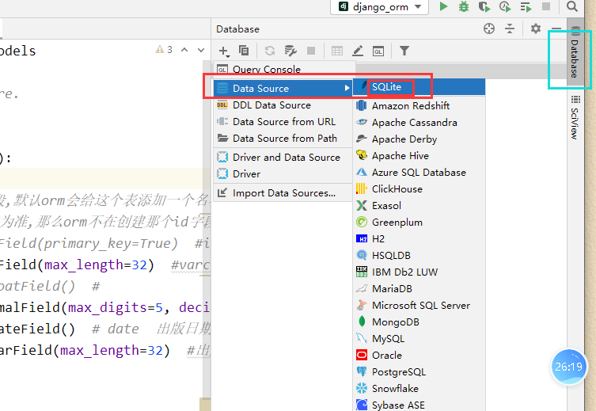
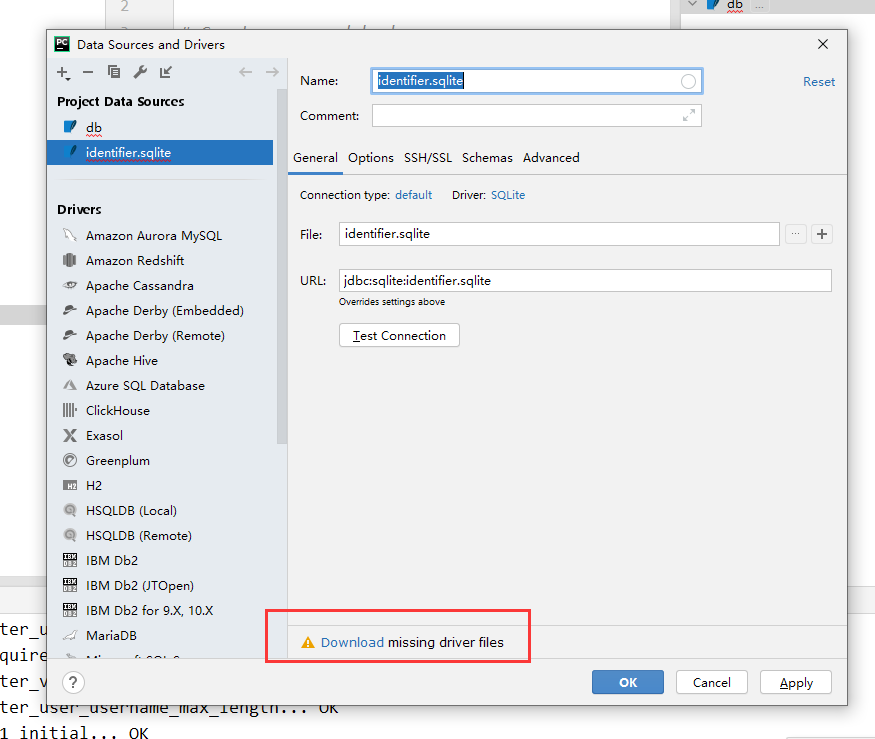
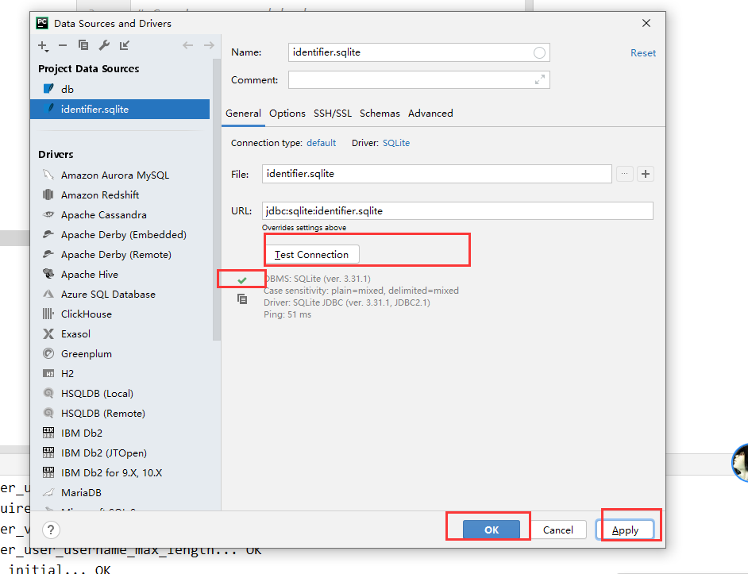
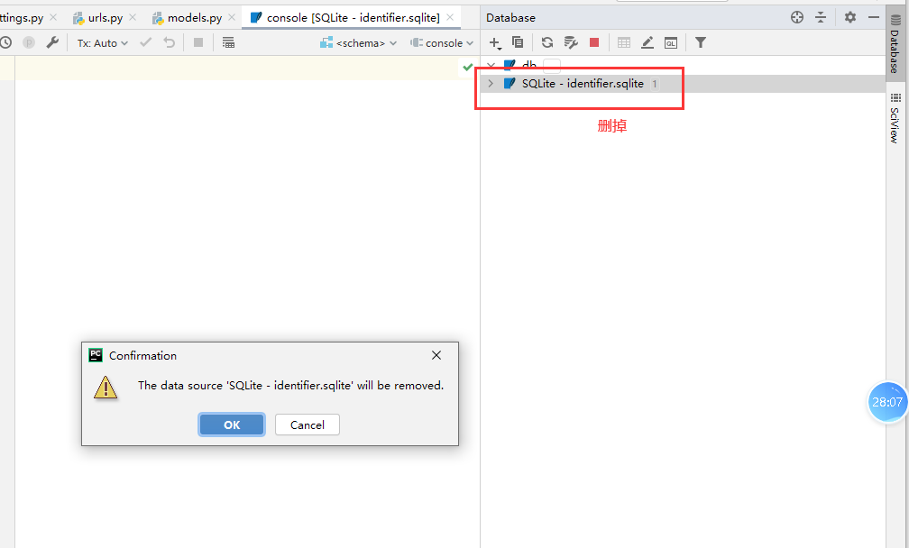
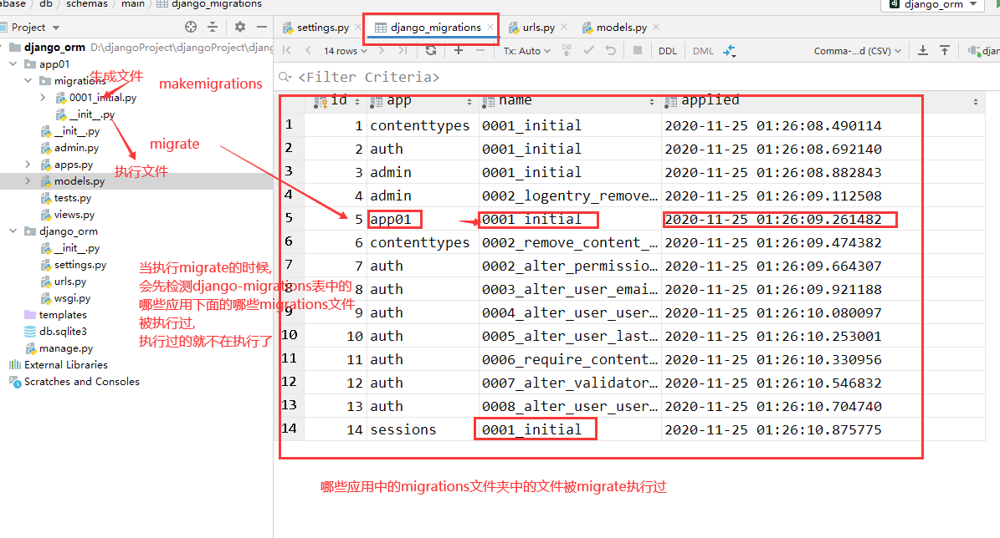
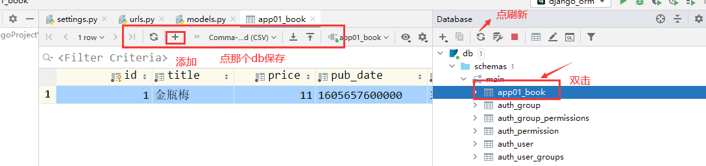
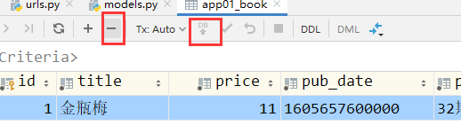

# ORM

- MVC或者MVC框架中包括一个重要的部分,就是ORM,它实现了数据模型与数据库的解耦,即数据模型的设计不属于依赖特定的数据库,通过简单的配置就可以轻松更换数据库,这极大地减轻了开发人员的工作量,不需要面对因数据库变更而导致的无效劳动;
- ORM是"对象-关系-映射"的简称.(Object Relational Mapping,简称ORM),将来会学习一个sqlalchemy,是和它很像的,但是django的orm没有独立出来让别人去使用,虽然功能比sqlalchemy更强大,但是别人用不了;
- 类对象->sql->pymysql->mysql服务端->磁盘,orm其实就是将类对象的语法翻译成sql语句的一个引擎,明白orm是什么了,剩下的就是怎么使用orm,怎么来写类对象关系语句.

M: model,数据库相关操作


**pycharm配置连接数据库**

第一步










**创建模型类**

在应用文件夹的models.py文件中写上如下内容

```python
# 属性对应的字段,默认都是不能为空的,也就是加了not null约束
class Book(models.Model):
	# 如果没有指定主键字段,默认orm会给这个表添加一个名称为id的主键自增字段
	# 如果指定了主键,那以指定的为准,那么orm就不在自动创建id字段了
	# nid = models.AutoField(reimary_key=True)	#int primary_key auto_increment
	title = models.CharField(max_length=32)	# varchar书籍名称
	# price = models.FloatField()
	price = models.DecimalField(max_digits=5, decimal_places=2)	  # 999.99最大价格
	pub_data = models.DateField()	# date出版日期
	publish = models.CharField(max_length=32)	# 出版社名称
	# xx = models.CharField(max_length=18, null=True, blank=True)	  # null=True,blank=True允许该字段数据为空
	# xx = models.CharField(max_length=18, default="xx")	# null=True,blank=True允许该字段数据为空

# Book生成的表名称为 应用名称_模型类名小写
```

**数据库同步(迁移)指令**

```python
python manage.py makemigration
python manage.py migrate
```

指令的执行流程:


pycharm的简单使用:





**django配置链接mysql**

1. 创建数据库

```shell
create database orm01 charset=utf8mb4;
```

2. settings.py配置文件中写上如下内容

```python
DATABASES = {
	"default": {
		"ENGINE": "django.db.backends.mysql",
		"NAME": "orm01",
		"HOST": "127.0.0.1",
		"PORT": 3306,
		"USER": "root",
		"PASSWORD": ""	# 有密码的填密码
	}
}
```

3. 安装pymysql

```shell
pip install pymysql
```

4. 在项目主目录下的`__init__.py`文件中写上如下内容

```python
import pymysql

pymysql.install_as_MySQLdb()
```

5. 执行数据库同步指令

```python
python manage.py migrate
```
只要换了新的数据库,migrate会重新执行migrations文件

查看orm的field对应MySQL的什么字段类型在下面看

```python
/Library/Frameworks/Python.framework/Versions/3.8/lib/python3.8/site-packages/django/db/backends/mysql/base.py
```

对应关系:

```python
 _data_types = {
        'AutoField': 'integer AUTO_INCREMENT',
        'BigAutoField': 'bigint AUTO_INCREMENT',
        'BinaryField': 'longblob',
        'BooleanField': 'bool',
        'CharField': 'varchar(%(max_length)s)',
        'CommaSeparatedIntegerField': 'varchar(%(max_length)s)',
        'DateField': 'date',
        'DateTimeField': 'datetime',
        'DecimalField': 'numeric(%(max_digits)s, %(decimal_places)s)',
        'DurationField': 'bigint',
        'FileField': 'varchar(%(max_length)s)',
        'FilePathField': 'varchar(%(max_length)s)',
        'FloatField': 'double precision',
        'IntegerField': 'integer',
        'BigIntegerField': 'bigint',
        'IPAddressField': 'char(15)',
        'GenericIPAddressField': 'char(39)',
        'NullBooleanField': 'bool',
        'OneToOneField': 'integer',
        'PositiveIntegerField': 'integer UNSIGNED',
        'PositiveSmallIntegerField': 'smallint UNSIGNED',
        'SlugField': 'varchar(%(max_length)s)',
        'SmallIntegerField': 'smallint',
        'TextField': 'longtext',
        'TimeField': 'time',
        'UUIDField': 'char(32)',
    }
```


### 记录的增删改查

**增加**

```python
# 添加数据记录
# 方式1
new_book = models.Book(
	# id = 2,
	title = "金瓶梅",
	price = 9.9,
	# pub_date = datetime.datetime.now()	# 添加时间日期类型数据时,可以是时间日期类型的数据,也可以是字符串数据
	pub_date = "2022-02-02",
	publish = "32期红浪漫出版社"
	# 有默认值的字段,可以为空的字段,主键字段,都可以不用传值
)
new_book.save()

# 方式2 create方法,create方法的返回值为新添加的数据的模型类对象
new_book = models.Book.objects.create(
	title = "金瓶梅2",
	price = 19.9,
	# pub_date = datetime.datetime.now(),
	pub_date = "2022-04-02",
	publish = "32期红浪漫出版社"
)

print(new_book.title)
# 通过模型类对象,直接获取属性对应的值
print(new_book.price)
```

**批量添加**

```python
obj_list = []
for i in range(10):
	book_obj = models.Book(
		title = f'少年阿斌{i}',
		price = 10 + i,
		pub_date = f'2022-04-1{i}',
		publish = '32期红浪漫出版社'
	)
	obj_list.append(book_obj)

# bulk_create 批量添加
models.Book.objects.bulk_create(obj_list)
```

**查询**

```python
book_objs = models.Book.objects.all()	# 查询全部,返回queryset类型数据,类似于列表
book_objs = models.Book.objects.filter(id=3)	# 条件查询,返回queryset类型数据
book_objs = models.Book.objects.filter()	# filter没有加条件,和all一样的效果
book_objs = models.Book.objects.filter(id=100)	# 查不到数据时,返回的是空的queryset类型数据

book_objs = models.Book.objects.get(id=3)	# 条件查询,返回的是模型类对象
book_objs = models.Book.objects.get()	# 也是查所有,但是get方法的查询结果有要求,有且只能有一条,查询结果多于一条也会报错
book_objs = models.Book.objects.get(id=100)	# 查询不到结果会报错,Book matching query does not exist
```

**删除**

```python
models.Book.objects.filter(id=3).delete()	# queryset类型的数据可以调用delete方法删除查询结果数据
models.Book.objects.get(id=4).delete()	# 模型类对象也可以调用delete方法删除数据
```

**修改**

```python
# 方式1 通过queryset类型数据修改
models.Book.objects.filter(id=5).update(
	price = 20,
	title = "xxxx"
)
# 报错:模型类对象不能调用update方法
models.Book.objects.get(id=5).update(
	price = 30,
)

# 方式2 通过模型类对象来修改
ret = models.Book.objects.get(id=5)
ret.price = 30
ret.title = '少年阿宾00'
ret.save()
```

**两个参数解释**

```python
DatetimeField, DateField, TimeField这三个时间字段都可以设置如下属性

auto_now_add	配置auto_now_add=True,创建数据记录的时候会把当前时间添加到数据库

auto_now	配置auto_now=True,每次更新数据记录的时候会更新该字段,标识这条记录最后一次的修改时间
```

示例:

```python
# update不能触发自动更新时间的auto_now参数的作用,如果用updat方法来更新记录,并保存更新记录的时间,需要手动给该字段传入当前时间
models.Book.objects.filter(id=1).update(
	name = 'xxoo',
	b1 = datetime.datetime.now()
)

# 通过save方式才能够触发auto_now参数自动更新修改时间的动作
ret = models.userinfo.objects.get(id=2)
ret.name = 'xxoo'
ret.save()
```

注意:
django默认用的utc时间来操作时间数据,如果需要改为本地时区存储时间,那么需要修改django的配置文件,在settings.py配置文件中修改如下内容:
```python
# USE_TZ = True
USE_TZ = False
```


### 基于双下划线的模糊查询

```python
# 查询以xx开头的数据
obj_list = models.Book.objects.filter(title__startswith='少年')
# 查询以xx结尾的数据
obj_list = models.Book.objects.filter(title__endswith='梅')
# 查询以xx开头的数据(区分大小写)
obj_list = models.Book.objects.filter(title__startswith='p')
# 查询以xx开头的数据(不区分大小写)
obj_list = models.Book.objects.filter(title__istartswith='p')
# 包含
obj_list = models.Book.objects.filter(title__contains='th')
# 包含,不区分大小写
obj_list = models.Book.objects.filter(title__icontains='th')

# 大于
obj_list = models.Book.objects.filter(price__gt=15)
# 大于等于
obj_list = models.Book.objects.filter(price__gte=15)
# 小于
obj_list = models.Book.objects.filter(price__lt=15)
# 小于等于
obj_list = models.Book.objects.filter(price__lte=15)

# 查询价格等于15或者等于18或者等于30的书籍
# obj_list = models.Book.objects.filter(price=15 or price=18 or price=30)	# error 不支持
obj_list = models.Book.objects.filter(price__in=[15,18,30])
# 查询价格大于等于15并且小于等于20的书籍 between and
obj_list = models.Book.objects.filter(price__range=[15,20])

# 逗号连接的查询条件就是and的关系
obj_list = models.Book.objects.filter(id=10, price=15)
# 查询2020年的所有书籍
obj_list = models.Book.objects.filter(pub_date__year='2020')
# 查询2020年11月份的所有书籍
obj_list = models.Book.objects.filter(pub_date__year='2020',pub_date__month='11')
# 查询2020年11月5号的所有书籍
obj_list = models.Book.objects.filter(pub_date__year='2020',pub_date__month='11',pub_date__day='25')
obj_list = models.Book.objects.filter(pub_date='2020-11-25')

print(obj_list)
```


