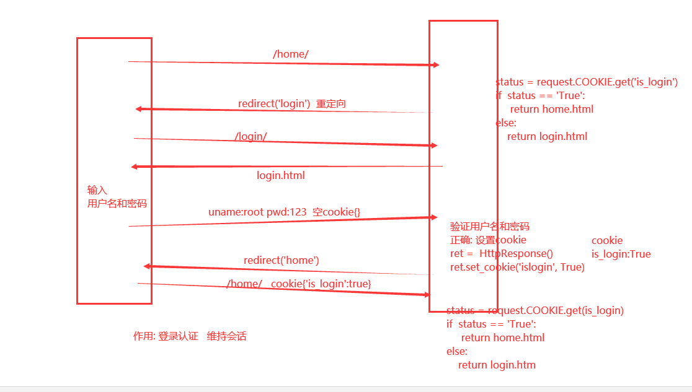
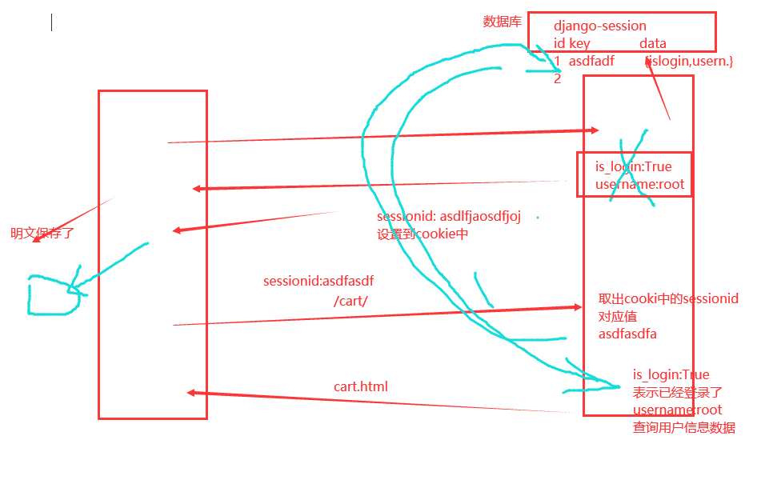

### 作业:

```python
book.pk		# pk获取记录的主键值
# 目前和id一样的效果
```


html中写相对路径时注意的问题,前置导航斜杠必须写

```html
比如获取当前页面的请求路径为 https://127.0.0.1:8000/books/

<!-- 有前置斜杠的 -->
url: '/ajax_del/book/'
发送的请求路径为: http;//127.0.0.1:8000/ajax_del_book/

<!-- 没有前置斜杠的 -->
url: 'ajax_del_book'
发送的请求路径为: http://127.0.0.1:8000/books/ajax_del_book/
```


## cookie和session

### http协议

无状态: 不会记录任何客户端和服务端的信息

无连接(closed)(短链接: keepalive): 一次请求一次响应,就断开连接了

```text
connection: keepalive
```


### 会话

http协议不能维持会话

cookie: 后端服务端给cookie中设置的令牌,键值对形式设置

cookie是浏览器技术,针对的就是http协议无状态,导致不能和服务端维持会话.例子:登录,登录之后,看到响应结果,继续访问其他界面,服务端要判断我是谁.


下次请求自动携带cookie


整个流程:




浏览器自动将每个网站的cookie保存到了客户端本地

```python
网址1: {xx:oo, xx1:oo1}
网址2: {xx:oo, xx1:oo1}
网址3: {xx:oo, xx1:oo1}
```

每次请求对应网址时,都会自动携带这个网址对应的cookie数据,放到http请求头部信息中.


### django的cookie操作

```python
# 设置cookie(包含添加和修改,键相同时是修改)
rep = HttpResponse(...)
rep = render(request, ...)
rep.set_cookie(key, value, ...)

# 获取cookie
request.COOKIES		# 字典类型数据
request.COOKIES['key']
request.COOKIES.get('key')

# 删除cookie
def logout(request):
	ret = redirect('login')
	ret.delete_cookie('is_login')

	return ret

# set_cookie的一些参数
	key, 键

	value='', 值

	max_age=None, 超时时间 单位秒数

	expires=None, 超时时间(IE requires expires, so set it if hasn't been already.)	值为时间日期类型数据

	path='/', cookie生效的路径,/ 表示根路径,特殊的:根路径的cookie可以被任何url的页面访问

	domain=None, cookie生效的域名

	secure=False, https传输

	httponly=False, 只能http协议传输,无法被JavaScript获取(不是绝对,底层抓包可以获取到也可以被覆盖)
```


### cookie的特点

```python
cookie大小上上限为4kb;
一个服务器最多在客户端浏览器上保存20个coolie;
一个浏览器最多保存300个cookie,因为一个浏览器按可以访问多个服务器;
cookie设置的数据是明文存储在客户端的,不安全
```


### session

由于cookie存储数据的大小限制,并且明文存储,看上去不安全,所以出现了session技术


#### session技术




特点:
数据存储到了服务端
大小无限制,并且表面上比cookie安全一些,最起码不是明文的


#### django的session操作

```python
# 获取值
request.session['k1']
request.session.get('k1', None)

# 设置值
request.session['k1'] = 123		# 键相同的还是修改
request.session.setdefault('k1', 123)

# 删除
# 删除单个数据
del request.session['k1']

# 删除所有数据
request.session.flush()
```


#### 关于session的一些配置方法

```python
# 设置会话session和cookie的超时时间
request.session.set_expiry(value)
	* 如果value是个整数,session会在xx秒后失效
	* 如果value是个datatime或timedelta,session就会在这个时间后失效
	* 如果value是0,用户关闭浏览器session就会失效
	* 如果value是None,session会依赖全局session失效策略

# 全局配置
# 1.数据库seddion
SESSION_ENGINE = 'django.contrib.sessions.backends.db'	# 引擎(默认)

# 2.缓存session
SEEION_ENGINE = 'django.contrib.sessions.backends.cache'	# 引擎
SESSION_CACHE_ALIAS = 'default'	  # 是用的缓存别名(默认内存缓存,也可以是memcache),此次别名依赖缓存的设置

# 3.文件session
SESSION_ENGINE = 'django.contrib.sessions.backends.file'	# 引擎
SESSION_FILE_PATH = None	# 缓存文件路径(写文件夹路径),如果为None,则使用tempfile模块获取一个临时地址tempfile.gettempdir()

# 4.缓存+数据库
SESSION_ENGINE = 'django.contrib.sessions.backends.cached_db'	# 引擎

# 5.加密cookie和session
SESSION_COOKIE_NAME = 'django.contrib.sessions.backends.signed_cookies'	# 引擎

# 其他公用设置项:
SESSION_COOKIE_NAME = 'sessionid'	# session的cookie保存在浏览器上时的key,即sessionid=随机字符串(默认)

SESSION_COOKIE_PATH = '/'	# session的cookie保存的路径(默认)

SESSION_COOKIE_DOMAIN = None	# session的cookie保存的域名(默认)

SESSION_COOKIE_SECURE = False	# 是否https传输cookie(默认)

SESSION_COOKIE_HTTPONLY = True	# 是否session的cookie只支持https传输(默认)

SESSION_COOKIE_AGE = 1209600	# session的cookie失效日期(2周)(默认)

SESSION_EXPIRE_AT_BROWSER_CLOSE = False	  # 是否关闭浏览器使得session过期(默认)

SESSION_SAVE_EVERY_REQUEST = Fasle	# 是否每次请求都保存session,默认修改之后才保存(默认)
```


