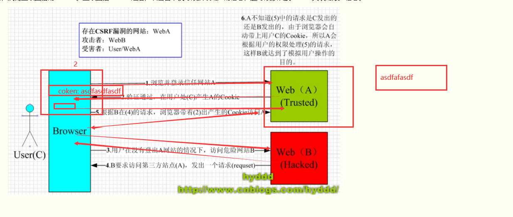
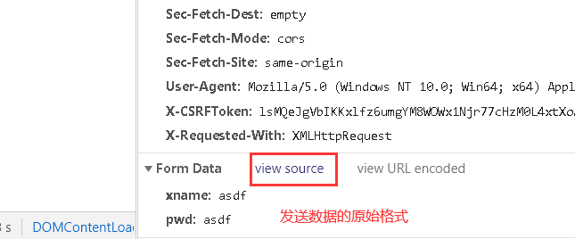

### js的正则校验

```js
var a = /^a/;	// 写法： /正则规则/
var s = 'sadsdsa';

a.test(s);	// 通过正则测试某个数据是否符合格式要求，符合得到true，不符合得到false;
false

var ss = 'asddweww';
a.test(ss);
true
```


## CSRF(Cross-site request forgery)

中文名称:跨站请求伪造,也被称为: one click attack/session riding,缩写为: CSRF/XSRF,攻击者通过HTTP请求将数据传送到服务器,从而盗取会话的cookie,盗取会话cookie之后,攻击者不仅可以获取用户的信息,还可以修改该cookie关联的账户信息




token字符串的前32位是salt,后面是加密后的token,通过salt能解密出唯一的secret,django会验证表单中的token和cookie中的token是否能解出同样的secret,secret一样则本次请求合法

```python
1. 在响应的页面中加入标签,那么在进行模板渲染时会生成如下标签: <input type="hidden" name="csrfmiddlewaretoken" value="ppwN8yg1wVEyXDxtMpVIrc4zV3gHiDKKb9rwGPLaSGRc0HKhXAwpNrKjGDUHIxjj">

2. 并且在响应含有这个标签的页面时,会添加cookie键值对,如下: csrftoken:lsMQeJgVbIKKxlfz6umgYM8WOWx1Njr77cHzM0L4xtXoApsnhFXXk1OGzwb1dd0G

3. 当用户从该页面提交数据时,会携带csrfmiddlewaretoken: ppwN8yg1wVEyXDxtMpVIrc4zV3gHiDKKb9rwGPLaSGRc0HKhXAwpNrKjGDUHIxjj和cookie键值对

4. 取出cookie中的csrftoken值和请求数据部分的csrfmiddlewaretoken的值,两者进行比较,这个随机字符串叫做token字符串,django如果在请求数据部分找不到token值,会去请求数据中的请求行部分,找一个叫做X-CSRFToken的键值对,如果这个键对应的值和cookie中csrftoken对应的值相同,也能通过认证;

	过程:
		token字符串的前32位是salt,后面是加密后的token,通过salt能解密出唯一的secret字符串
		secret: 是settings配置文件中的secret_key, SECRET_KEY = 's!xbzez1zxrevmq7k_89%%-z&#)e7686pyq8pg@_bp_k_2s^ho'
		django会验证表单中的token和cookie中的token是否能解出同样的secret,secret一样则本次请求合法,如果不同就403 forbidden
```


### ajax通过django的csrf_token认证机制的写法

方式1:

```html
	

	$('#btn').click(function(){
		var uname = $('#username').val();
		var password = $('#password').val();
		var token = $("[name='csrfmiddlewaretoken']").val();

		$.ajax({
			type: 'post',
			url: '/login/',
			data: {xname: uname, pwd: password, csrfmiddlewaretoken: token},
			success: function(res){
				console.log('success', res);
			}
			error: function(error){
				console.log('error', error);
				$('#ajax_error').text(error.responseText);
			}
		})
	})
```

方式2:

```html
	$.ajax({
		type: 'post',
		url: '/login/',
		// {{ csrf_token }}拿到的是生成的input标签的那个value属性的token值
		data: {xname: uname, pwd: password, csrfmiddlewaretoken: '{{ csrf_token }}'},
		success: function(res){
			console.log('success', res);
		}
		error: function(error){
			console.log('error', error);
			$('#ajax_error').text(error.responseText);
		}
	})
```

方式3: 添加请求头键值对,键必须叫做: 'X-CSRFToken',值是cookie中的token值

```html
	$.ajax({
		type: 'post',
		url: '/login/',
		data: {xname: uname, pwd: password}.
		headers: {	//设置请求头键值对
			'X-CSRFToken': $.cookie('csrftoken'),
		},
		success: function(res){
			console.log('success', res);
		},
		error: function(error){
			console.log('error', error);
			$('#ajax_error').text(error.responseText);
		}
	})
```

jquery操作cookie,下载jquery.cookie.js文件

```python
http://plugins.jquery.com/cookie
https://www.bootcdn.cn/jquery-cookie
```

引入使用
```js
<script type="text/javascript" src="js/jquery.min.js"></script>
<script type="text/javascript" scr="js/jquery.cookie.js"></script>
```

cookie操作

```js
// 添加cookie
	$.cookie('the_cookie', 'the_value');
// 读取cookie
	$.cookie('the_cookie');		// the_cookie是键
// 删除cookie
	$.cookie('the_cookie', null);	// 通过传递null作为cookie的值即可
```


### content-type介绍




http协议默认的请求数据格式为: application/x-www-form-urlencoded, 不管是post请求还是get请求,携带的数据都是 a=1&b=2,django能够解析这个格式的数据,但当我们指定了请求数据格式为: application/json时,发送的数据格式为: {a:1, b:2} json数据,django解析不了,比如发送一个application/json格式的数据

```html
$.ajax({
	type: 'post',
	url: '/login/',
	contentType: 'application/json',
	data: JSON.stringify({xname: uname, pwd: password}),
	headers: {
		'X-CSRFToken': $.cookie('csrftoken'),
	},
	success: function(res){
		console.log('success',res);
	},
	error: function(error){
		console.log('error', error);
		$('#ajax_error').text(error.responseText);
	}
})
```

django的request.POST拿不到数据了,需要我们自己去request.body中获取原始的bytes类型数据,然后进行解析:
```python
import json

data = request.body
data = data.decode()
data = json.loads(data)
print(data, type(data))
```


### 上传文件

#### form表单上传文件

```html
<form action="" method="post" enctype="multipart/form-data">
	
	用户名: <input type="text" name="username">
	密码: <input type="password" name="password">
	<!-- 头像: <input type="file" name="avatar" multiple> -->
	<input type="file" name="avatar">
	<input type="submit">
</form>
```

views

```python
def upload(request):

	if request.method == "GET":
		return render(request, 'upload.html')
	else:
		print(request.POST)	 # 如果没有修改请求消息格式(content-type),那么文件名称会在request.POST中拿到,但是只是文件名称
		print(request.FILES)	# 里面放的是文件数据(文件对象,类似于文件句柄)
		# print(request.FILES.getlist('avatar'))
		# print(request.FILES.get('avatar'))	# timg.jpg
		file_obj = request.FILES.get('avatar')
		print(file_obj.name)	# 文件名称

		with open(file_obj.name, 'wb') as f:
			# for i in file_obj:
				# f.write(i)
			for i in file_obj.chunks():
				# 默认一次返回大小为65536B,也就是64KB,最大为2.5M,是一个生成器
				f.write(i)
		return HttpResponse('ok')
```


#### ajax上传文件

```html
$('#sub').click(function(){
	var uname = $('[name="username"]').val();
	var pwd = $('[name="password"]').val();
	var file_obj = $('[type="file"]')[0].files[0];

	<!-- ajax上传文件: 必须将文件数据放到一个叫做formdata的对象中才能发送 -->
	var formdata = new FormData();
	formdata.append('username', uname);
	formdata.append('password', pwd);
	formdata.append('csrfmiddlewaretoken', '{{ csrf_token }}')
	formdata.append('avatar', file_obj)	  <!-- request.FILES.get('avatar') -->

	$.ajax({
		url: '/upload/',
		type: 'post',
		data: formdata,	  <!-- ajax会将本次请求的数据格式改为content-type: multipart/form-data -->
		<!-- 告诉ajax不要对数据进行预处理和加工,上传文件必须加上这两个参数 -->
		contentType: false,
		processData: false,
		success: function(res){
			console.log(res);
		}
	})
});
```

views和上面一样

```python
def upload(request):

	if request.method == "GET":
		return render(request, 'upload.html')
	else:
		print(request.POST)	# 如果没有修改请求消息格式(content-type),那么文件名称会在request.POST中拿到,但是只是文件名称
		print(request.FILES)	# 里面放的是文件数据(文件对象,类似于文件句柄)
		# print(request.FILES.getlist('avatar'))
		# print(request.FILES.get('avatar'))  # timg.jpg
		file_obj = request.FILES.get('avatar')
		print(file_obj.name)	# 文件名称

		with open(file_obj.name, 'wb') as f:
			# for i in file_obj:
				# f.write(i)
			for i in file_obj.chunks():
				# 默认一次返回大小为经测试为65536B，也就是64KB，最大为2.5M，是一个生成器
				f.write(i)
		return HttpResponse('ok')
```


