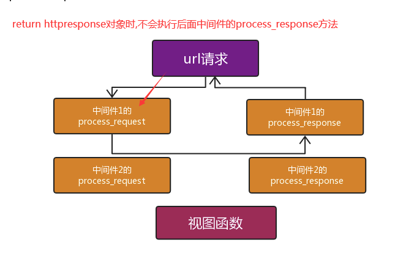
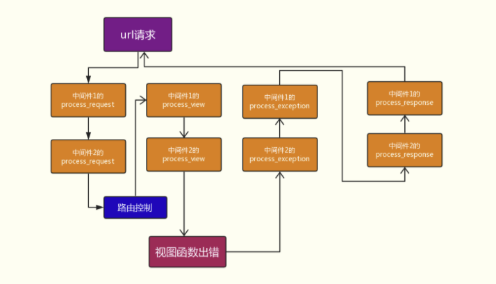

## 中间件

对所有请求和响应做一些统一处理

自定义中间件的流程:

1. 在应用中创建一个py文件,比如mymiddleware.py

2. py文件写如下内容
```python
from django.shortcuts import redirect, HttpResponse, render
from django.utils.deprecation import MiddlewareMixin

# 登录认证中间件
class LoginAuth(MiddlewareMixin):
	# 白名单
	white_list = ['/login/', '/register/']

	# 对请求处理用process_request,如果请求通过了处理,就return None,如果没有通过,直接return HttpResponse对象
	def process_request(self, request):
		current_path = request.path
		if current_path not in self.white_list:
			status = request.session.get('is_login')
			if not status:
				# return HttpResponse('ok')
				# 如果return的是一个HttpResponse对象,那么中间件执行到这里直接返回
				return redirect('login')
		print('请求他来了!!!')
```

3. 在settings配置文件中加上我们定义的类的路径

```python
MIDDLEWARE = [
	'django.middleware.security.SecurityMiddleware',
    'django.contrib.sessions.middleware.SessionMiddleware',  # 封装session功能的 ,request.session['xx'] ='oo'
    'django.middleware.common.CommonMiddleware',
    'django.middleware.csrf.CsrfViewMiddleware',
    'django.contrib.auth.middleware.AuthenticationMiddleware',
    'django.contrib.messages.middleware.MessageMiddleware',
    'django.middleware.clickjacking.XFrameOptionsMiddleware',

    # 尽量将自己定义的中间件放到最后
    'app01.mymiddleware.LoginAuth',
]
```


### process_request

只有定义了process_request方法的中间件才会对请求做处理,不然不会执行到这个中间件




### process_response

```python
class Md1(MiddlewareMixin):

	def process_request(self, request):
		print('Md1-process_request')
		# return HttpResponse('ok')	 # 如果return的是一个HttpResponse对象,那么中间件执行到这里,直接返回

	def process_response(self, request, response):
		# print(response)	# #<HttpResponse status_code=200, "text/html; charset=utf-8">
		# print(response.content)	# b'index'
		# response['xx'] = 'oo'	 # 统一添加响应头
		print('Md1-process_response')
		# return HttpResponse('ok')	 # 如果return的是HttpResponse对象,那么会替换视图函数中的返回值
		return response	 # 注意: 一定要return response


class Md2(MiddlewareMixin):

	def process_request(self, request):
		print('Md2-process_request')

	def process_response(self, request, response):
		print('Md2-process_response')
		return response
```


### process_view


### process_exception



```python
class Md1(MiddlewareMixin):

	def process_request(self, request):
		print('Md1-process_request')

	def process_view(self, request, view_func, view_args, view_kwargs)
		print('Md1-process_view')
		print(view_func, view_args, view_kwargs)
		# return HttpResponse('not ok')

		# <function index at 0x00000279D59709D8> ('100',) {}

	def process_response(self, request, response):
		print('Md1-process_response')
		return response

	def process_exception(self, request, exception):
		print(exception, type(exception))
		print('Md1-process_exception')
		# xxxxxxxxxxx <class 'ValueError'>
		# 统一做异常处理
		if isinstance(exception, ValueError):
			return HttpResponse('视图函数报错啦!!!', status=500)


class Md2(MiddlewareMixin):

	def process_request(self, request):
		print('Md2-process_request')

	def process_view(self, request, view_func, view_args, view_kwargs):
		print('Md2-process_view')

	def process_response(self, request, response):
		print('Md2-process_response')
		return response

	def process_exception(self, request, exception):
		print('Md2-process_exception')
```


### process_template_response

process_template_response(self, request, response),知道名字即可


### 中间件的应用场景

1. 做IP访问频率限制: 某些IP访问服务器的频率过高,进行拦截,比如限制每分钟不能超过20次

2. URL访问过滤: 如果用户访问的是login视图,则放过;如果访问的是其他视图,需要检测是不是有session认证,已经有了则放行,没有返回login,这样就省的在多个视图函数上写装饰器了


## choices参数说明

```python
sex_choice = (
	(0, '女性'),
	(1, '男性'),
)


class Author(models.Model):
	name = models.CharField(max_length=32)
	age = models.IntegerField()

	sex_choice = (
		(0, '女性'),
		(1, '男性')
	)

	sex = models.IntegerFiled(choices=sex_choice, default=1)	# choices关键字固定
```


## 滚动事件监听

```js
window.onscroll(function(){
	console.log(window.scrollY)		// 获取滚动距离
})
```


## 分页

```python
class Pagination(object):
	"""自定义分页(Bootstrap)"""
	def __init__(self, current_page, total_count, base_url, per_page=10, max_show=11):
		"""
		:param current_page: 当前请求的页面
		:param total_count: 总数据量
		:param base_url: 请求的url
		:param per_page: 每页显示的数据量,默认为10
		:param max_show: 页面上最多显示多少个页面,默认值为11
		"""
		try:
			self.current_page = int(current_page)
		except Exception as e:
			# 娶不到或者页码数不是数字都默认展示第1页
			self.current_page = 1
		# 定义每页显示多少条数据
		self.per_page = per_page
		# 计算出总页码数
		total_count, more = divmod(total_count, per_page)
		if more:
			total_page += 1
		self.total_page = total_page
		# 定义页面上最多显示多少页面(为了左右对称,一般设为奇数)
		self.max_show = max_show
		self.half_show = max_show // 2
		self.base_url = base_url

	@property
	def start(self):
		return (self.current_page - 1) * self.per_page

	@property
	def end(self):
		return self.current_page * self.per_page

	def page_html(self):
		# 计算一下页面显示的页码范围
		if self.total_page <= self.max_show:	# 总页码数小于最大显示页码数
			page_start = 1
			page_end = self.total_page
		elif self.current_page + self.half_show >= self.total_page:		# 右边越界
			page_end = self.total_page
			page_start = self.total_page - self.max_show
		elif self.current_page - self.half_show <= 1:	# 左边越界
			page_start = 1
			page_end = self.max_show
		else:	# 正常页面区间
			page_start = self.current_page - self.half_show
			page_end = self.current_page + self.half_show
		# 生成页面上显示的页码
		page_html_list = []
		page_html_list.append('<nav aria-label="Page navigation"><ul class="pagination">')
		# 加首页
		first_li = '<li><a href="{}?page=1">首页</a></li>'.format(self.base_url)
		page_html_list.append(first_li)
		# 加上一页
		if self.current_page == 1:
			prev_li = '<li><a href="#"><span aria-hidden="true">&laquo;</span></a></li>'
		else:
			prev_li = '<li><a href="{}?page={}"><span aria-hidden="true">&laquo;</span></a></li>'.format(self.base_url, self.current_page - 1)
		page_html_list..append(prev_li)
		for i in range(page_start, page_end + 1):
			if i == self.current_page:
				li_tag = '<li class="active"><a href="{0}?page={1}">{1}</a></li>'.format(self.base_url, i)
			else:
				li_tag = '<li><a href="{0}?page={1}">{1}</a></li>'.format(self.base_url, i)
			page_html_list.append(li_tag)
		# 加下一页
		if self.current_page == self.total_page:
			next_li = '<li><a href="#"><span aria-hidden="true">&raquo;</span></a></li>'
		else:
			next_li = '<li><a href="{}?page={}"><span aria-hidden="true">&raquo;</span></a></li>'.format(
                self.base_url, self.current_page + 1)
		page_html_list.append(next_li)
		# 加尾页
		page_end_li = '<li><a href="{}?page={}">尾页</a></li>'.format(self.base_url, self.total_page)
		page_html_list.append(page_end_li)
		page_html_list.append('</ul></nav>')
		return "".join(page_html_list)
```


