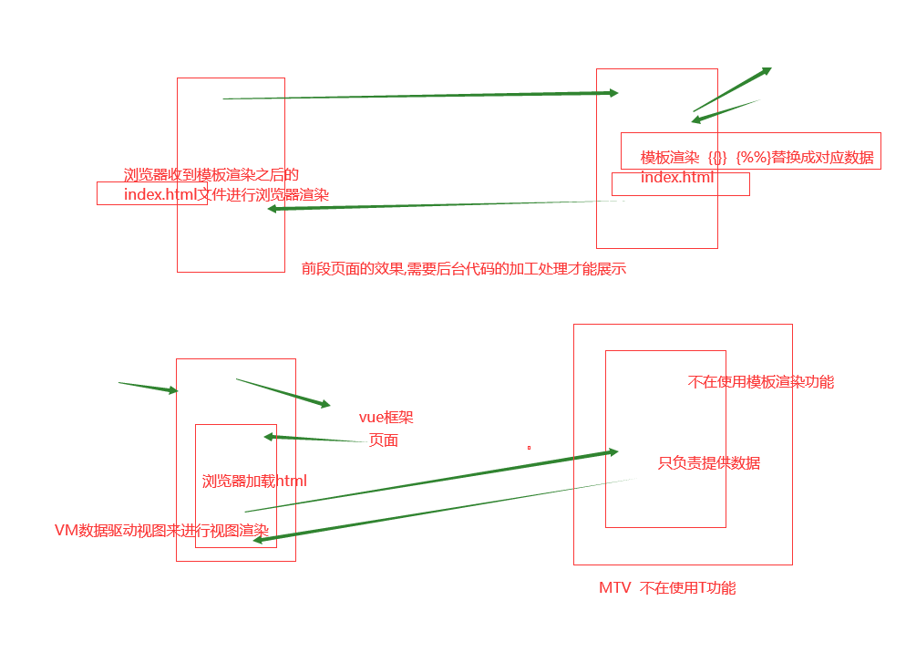
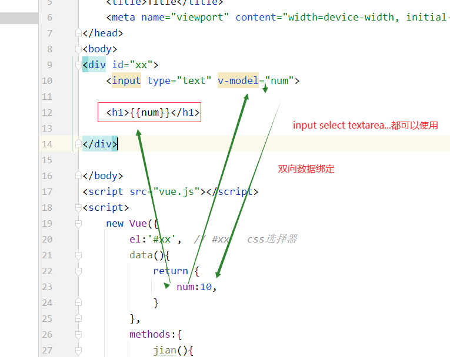

# Vue 前端框架

MVVM --	model - view - viewmodle -template模板渲染

model -- 数据
view -- 视图 	-- html标签 类似于jquery
$('#d1').text('xxx')

viewmodel: 数据驱动视图, vue的核心,model数据直接驱动到视图中(html标签中)

django -- MTV模式	model - template - view + url控制器 template这一块功能就去掉了

view -- 视图: 后端逻辑 FBV和CBV

前端 ECMAScript5 -- es5

vue多数用的都是es6语法


## 前戏

### es6的基本语法

```js
let
特点:
1. a是局部作用域的function xx(){let a = 'xxoo';}	if(){let a = 'ss'}
2. 不存在变量提升
3. 不能重复声明(var可以重复声明), var声明的不能用let再次声明,反之也是
4. let声明的全局变量不从属于window对象,var声明的全局变量从属于window对象

关于4个特点的简单说明:
	ES5声明变量只有两种方式: var和function
	ES6有let, const, import, class再加上ES5的var,function共有六种声明变量的方式
	还需要了解顶层对象: 浏览器环境中顶层对象时window
	ES5中,顶层对象的属性等价于全局变量. var a = 10; window.a
	ES6中,有所改变: var,function声明的全局变量,依然是顶层对象的属性;let, const, class声明的全局变量不属于顶层对象的属性,也就是说ES6开始,全局变量和顶层对象的属性开始分离,脱钩,目的是以防声明的全局变量将window对象的属性造成污染,因为window对象是顶层对象,它里面的属性是各个js程序中都可以使用的,不利于模块化开发,并且window对象有很多的自有属性,也为了防止对window的自有属性的污染,所以在ES6中将顶层对象和全局变量进行隔离.
	举例:
		var a = 1;
		console.info(window.a);	// a

		let b = 2;
		console.info(window.b);	// undefined

console.log(a);	-- undefined
var a = 10;

var b = '景顺';
console.log(c);	-- 报错
let c = '谢景顺';

const:
特点:
1. 局部作用域
2. 不存在变量提升
3. 不能重复声明
4. 一般声明不可变的量
const pi = 3.1415926;
// pi = 'xx' -- 报错

模版字符串:tab键上面的反引号, ${变量名}来插入值,类似于python的三引号"""adsdsa""",可以写多行文本,另外还可以通过它来完成字符串格式化
示例:
	let bb = 'jj';
	var ss = `您好${bb}`;
	console.log(ss);	-- '您好jj'
```


### es5和es6的函数对比

```js
// ES5写法
function add(x){
	return x;
};
add(5);
// 匿名函数
var add = function(x){
	return x;
};
add(5);
// ES6的匿名函数
let add = function(x){
	return x;
};
add(5);
// ES6的箭头函数,就是上面方法的简写形式
let add = x => {
	console.log(x);
	return x;
};
console.log(add(20));
// 更简单的写法,但是不是很易阅读
let add = x => x;
console.log(add(5));
多个参数的时候必须加括号,函数的返回值还是只能有一个,没有参数的,必须写一个()
let add = (x,y) => x+y;
```


### 自定义对象中封装函数的写法

```js
// ES5对象中封装函数的方法
var name = '子君';
var person1 = {
	name: '超',
	age: 18,
	f1: function(){		// 在自定义的对象中放函数的方法
		console.log(this);
		console.log(this.name);
	}
};

// ES5对象中封装函数的方法
var name = '子君';
var person1 = {
	name:'超',
	age:18,
	f1:function(){		// 在自定义的对象中放函数的方法
		console.log(this);
		let aa = {
			aaa:'xx',
			af:()=>{console.log(this)}
		};
		aa.af()
	}
};
//<h1 id='d1'>xxx</h1>
// document.getElementById('d1').onclick = function(){this.innerText;};
person1.f1();	// 通过自定义对象来使用函数

// ES6中自定义对象来封装箭头函数的写法
let username = '子君';	// window.username
let person2 = {
	name:'超',
	age:18,
	// f1:function(){}
	f1:() => {	// 在自定义的对象中放函数的方法
		console.log(this);	// this指向的不再是当前的对象了,而是执行了person的父集对象(称为上下文),而此时的父集对象是我们的window对象,Window {postMessage: ƒ, blur: ƒ, focus: ƒ, close: ƒ, frames: Window, …}
		console.log(window);	// 还记得window对象吗?全局浏览器对象,打印结果和上面一样: Window {postMessage: ƒ, blur: ƒ, focus: ƒ, close: ƒ, frames: Window, …}
		console.log(this.username)	// '子君'
	}
};
person2.f1();	// 通过自定义对象来使用函数
person2 -- window.person2
// 而我们使用this的时候,希望this是person对象,而不是window对象,所以还有下面这种写法
let person3 = {
	name:'超',
	age:18,
	// f1:function(){};
	// f1(){}
	f1(){	// 相当于f1:function(){},只是一种简写方式,称为对象的单体模式写法,写起来也简单,vue里面会用到这种方法
		console.log(this);	// this指向的是当前的对象,{name: "超", age: 18, f1: ƒ}
		console.log(this.name);	// '超'
	}
};
person3.f1()


let name2 = '昭志';
let person2 = {
	name2:'胡玲',
	age:18,
	f1:() => {
		console.log(this);
		console.log(this.name2)
	}
};
person2.f1()
```


### es5和es6的类写法对比(了解)

```js
<script>
	// ES5写类的方式
	function Person(name, age){
		//封装属性
		this.name = name;	// this -- python中的self
		this.age = age;
	}
	// 封装方法,原型链
	Person.prototype.f1 = function(){
		console.log(this.name);	// this指的是Person对象,结果:'超'
	};
	// 封装方法,箭头函数的形式写匿名函数
	Person.prototype.f2 = () => {
		console.log(this);	// Window {postMessage: ƒ, blur: ƒ, focus: ƒ, close: ƒ, frames: Window, …}  this指向的是window对象
	};

	var p1 = new Person('超', 18);
	p1.age

	p1.f1();
	p1.f2();

	// 其实在es5中我们讲js的基本语法的时候,没有讲类的继承,但是类也是可以继承的,继承之后,可以通过子类实例化的对象调用父类的方法

	class Person2{
		constructor(name,age){
			// 对象里面的单体模式,这个方法类似于python的__init__()构造方法,写参数的时候也可以写关键字参数constructor(name='超2',age=18)
			// 封装属性
			this.name = name;
			this.age = age;
		}	// 注意这里不能写逗号
		showname(){	// 封装方法
			console.log(this.name);
		}	// 不能写逗号
		showage(){
			cosnole.log(this.age);
		}
	}
	let p2 = new Person2('超2', 18);
	p2.showname()	// 调用方法 '超2'
	// es6的类也是可以继承的,使用extends和super方法
</script>
```


# 1. vue.js的快速入门使用

## 1.1 vue.js库的下载

vue.js是目前前端web开发最流行的工具库,由尤雨溪在2014年2月发布的.

另外几个常见的工具库: react.js / angular.js


官方网站:

​	中文：https://cn.vuejs.org/

​	英文：https://vuejs.org/

官方文档：https://cn.vuejs.org/v2/guide/

vue.js目前有1.x, 2.x和3.x版本, 我们学习2.x版本的.2.x到3.x是平滑过渡的,	也就是说之前用2.x写的代码,用3.x的版本的vue.js也是没问题的


## 1.2 vue.js库的基本使用

在github下载：https://github.com/vuejs/vue/releases

在官网下载地址： <https://cn.vuejs.org/v2/guide/installation.html>

vue的引入类似于jQuery,开发中可以使用开发版本vue.js,茶品上线要换成vue.min.js

```html
<!DOCTYPE html>
<html lang="en">
<head>
    <meta charset="UTF-8">
    <title>Document</title>
    <script src="js/vue.min.js"></script>
    
</head>
<body>
	<div id='app'>
	<!-- {{ message }} 标识把vue对象里面data属性中的对应数据输出到页面中,在双标签中显示数据要通过{{  }}来完成 -->
		<p>{{ message }}</p>
	</div>
</body>
<script>
	// vue.js的代码开始于一个Vue对象,所以每次操作数据都要从声明Vue对象开始
	let vm = new Vue({
		el:'#app',	// 设置当前vue对象要控制的标签范围
		// data属性写法方式1
		// data:{
		// 	// data是将要展示到html标签元素中的数据
		// 	message: 'hello world',
		// }
		// 方式2
		// data: function(){
		// 	return {
		// 		'msg':'掀起你的盖头来1'
		// 	}
		// }
		// 方式3
		data(){
			// 单体模式,这种写法用的居多,并且后面学习中有地方一定要这样写,所以主要记这种写法
			return {
				'msg': '掀起你的盖头来2',
			}
		}
	});
</script>
```


总结:

```html
1. vue的使用要从创建Vue对象开始
	var vm = new Vue();

2. 创建vue对象的时候,需要传递参数,是自定义对象,自定义对象必须至少有两个属性成员
	var vm = new Vue({
		<!-- 圈地:要通过vue语法来控制id属性值为app的标签,在这个标签内部,就可以使用vue的语法,这个标签外部不能使用vue语法 -->
		el:'#app',

		<!-- 数据属性定义的方式1 -->
		data: {
			数据变量:'变量值',
			数据变量:'变量值',
			数据变量:'变量值'
		},
		<!-- 数据属性定义的方式2(常用) -->
		data(){
			return {
				msg:'hello world',
			}
		}
	});

	<!-- el:圈地,划地盘,设置vue可以操作的html内容范围,值就是css的id选择器,其他选择器也可以,但是多用id选择器.
	data:保存vue.js中要显示到html页面的数据. -->

3. vue.js要控制器的内容外围,必须先通过id来设置
	<div id='app'>
		<h1>{{ message }}</h1>
		<p>{{ message }}</p>
	</div>
```

vue中的变量可以直接进行一些简单的js操作

```html
<!DOCTYPE html>
<html lang="en">
<head>
    <meta charset="UTF-8">
    <title>test vue</title>
</head>
<body>
	<div id='app'>
		<!-- vue的模版语法,和django的模版语法类似 -->
		<h2>{{ msg }}</h2>
		<!-- 放一个变量,会到data属性中去找对应的值,不能直接写数据,将来的数据都是从后端动态获取到的 -->
		<h2>{{ 'hello beautiful girl!' }}</h2>	<!-- 直接放一个字符串 -->
		<h2>{{ num + 1 }}</h2>	<!-- 四则运算 -->
		<h2>{{ 2+1 }}</h2>	<!-- 四则运算 -->
		<h2>{{ {'name':'chao'} }}</h2>	<!-- 直接放一个自定义对象 -->
		<h2>{{ person.name }}</h2>	<!-- 下面data属性里面的person属性中的name属性的值 -->
		<h2>{{ 1>2?'真的':'假的' }}</h2>	<!-- js的三元运算 -->
		<h2>{{ msg.split('').reverse().join('') }}</h2>	<!-- 字符串反转 -->
	</div>


	<!-- 1. 引包 -->
	<script src='vue.js'></script>
	<script>
		// 2. 实例化对象
		new Vue({
			el:'#app',
			data:{
				msg:'黄瓜',
				person:{
					name:'超',
				},
				msg2:'hello Vue',
				num:10,
			}
		})
	</script>
</body>
</html>
```


## 1.3 vue.js的M-V-VM思想

MVVM是Model-View-ViewModel的缩写,它是一种基于前端开发的架构模式

`Model` 指代的就是vue对象的data属性里面的数据,这里的数据要显示到页面中

`View` 指代的就是vue中数据要显示的HTML页面,在vue中,也称之为"视图模版"

`ViewModel` 指代的是vue.js中我们编写代码时的vm对象了,他是vue.js的核心,负责链接View和Model,保证视图和数据的一致性,所以前面代码中,data里面的数据被显示在p标签中就是vm对象自动完成的



编写代码,让我们更加清晰的了解MVVM:

```html
<!DOCTYPE html>
<html lang="en">
<head>
    <meta charset="UTF-8">
    <title>Title</title>
</head>
<body>
	<div id='app'>
		<!-- 在双标签中显数据要通过{{  }}来完成 -->
		<h1>{{ name }}</h1>
		<p>{{ age }}</p>
		<!-- 在表单输入框中显示数据要使用v-model来完成 -->
		<input type="text" v-model="name">
	</div>

    <script src="js/vue.min.js"></script>
    <script>
    	window.onload = function(){
    		// 创建vm对象
    		var vm = new Vue({
    			el:'#app',
    			data:{
    				name:'大标题',
    				age:16
    			},
    		})
    	}
    </script>
</body>
</html>
```

代码执行效果：


在浏览器中可以在console.log通过vm对象直接访问el和data属性,神之可以访问data里面的数据

```javascript
console.log(vm.$el);		# #app vm对象可以控制的范围
console.log(vm.$data);		# vm对象要显示到页面中的数据
console.log(vm.message);	# 这个message就是data里面声明的数据,也可以使用vm.变量名显示其他数据,message只是举例
```


# 2. Vue指令系统的常用指令

指令(Directives)是带有"v-"前缀的特殊属性,每一个指令在vue中都有固定的作用.

在vue中,提供了很多指令,常用的有: v-html, v-if, v-model, v-for等等


## 2.1 文本指令v-html和v-text

v-text相当于js代码的innerText,相当于我们上面说的模版语法,直接在html中插值了,插得就是文本,如果data里面写了个标签,那么通过模版语法渲染的是文本内容,这个v-text就是辅助我们使用模版语法的

v-html相当于innerHtml

```html
<!DOCTYPE html>
<html lang="en">
<head>
    <meta charset="UTF-8">
    <title>Title</title>
    <meta name="viewport" content="width=device-width, initial-scale=1">
</head>
<body>
	<div id="app">
		<!-- <h1>{{ atag }}</h1>和v-text指令系统做的是一样的 -->
		<h1 v-text="atag"></h1>
		<h1 v-html="atag"></h1>		<!-- 能够将标签字符串识别成标签效果 -->
		<!-- <h1 v-text="num"></h1> -->
		<h1 v-text="num+1"></h1>
	</div>

</body>

<script src="vue.js"></script>
<script>
	let vm = new Vue({
		el:'#app',
		data(){
			return {
				atag: '<a href="http://www.baidu.com">百度</a>',
				num: 20
			}
		}
	})
</script>
</html>
```


## 2.2 条件渲染指令v-if和v-show

vue中提供了两个指令可以用于判断是否要显示元素,分别是v-if和v-show

### 2.2.1 v-if

```html
<!DOCTYPE html>
<html lang="en">
<head>
    <meta charset="UTF-8">
    <title>Title</title>
    <meta name="viewport" content="width=device-width, initial-scale=1">
</head>
<body>
	<div id="app">
		<a href="" v-if="num>20">百度1</a>
		<a href="" v-else-if="num<20">百度2</a>
		<h1 v-else>京东</h1>
	</div>
</body>
<script src="vue.js"></script>
<script>
	let vm = new Vue({
		el:'#app',
		data(){
			return {
				num:21,
			}
		}
		// vm.num = 18;
		// 我们发现当num的值被重新赋值时,vue的视图部分(html)会自动发生变化,这就是数据驱动视图,以后视图的效果都是通过数据来控制的
	})
</script>
</html>
```

### 2.2.2 v-show

```html
标签元素:
	<h1 v-show='ok'>Hello!</h1>
data数据:
	data:{
		ok:false	// true则显示,false是隐藏
	}
```

简单总结v-if和v-show

```text
v-show后面不能v-else或者v-else-if

v-show隐藏元素时,使用的是display:none来隐藏的,而v-if是直接从HTML文档中移除元素[DOM操作中的remove]

v-if也是惰性的:如果在初始渲染时条件为假,则什么也不做一直到条件第一次变为真时,才会开始渲染条件块

相比之下,v-show就简单的多,不管初始条件是什么,元素总是会被渲染,并且只是简单的基于CSS进行切换

一般来说,v-if有更高的切换开销,而v-show有更高的初始渲染开销,因此,如果需要非常频繁的切换,则使用v-show较好;如果在运行时条件很少改变,则使用v-if较好.
```


## 2.3 操作属性v-bind

格式:

```html
<标签名 :标签属性="data属性"></标签名>
```

```html
<p :title='str1'>{{ str1 }}</p>		<!-- 也可以使用v-html显示双标签的内容, {{  }}是简写 -->
<a :href='url2'>淘宝</a>
<a v-bind:href='url1'>百度</a>		<!-- v-bind是vue1.x版本的写法 -->

<!-- 简单示例: -->
<!DOCTYPE html>
<html lang="en">
<head>
    <meta charset="UTF-8">
    <title>Title</title>
    <meta name="viewport" content="width=device-width, initial-scale=1">
</head>
<body>
	<div id="app">
		<h1 v-bind:xx='xxattr'>xxoo</h1>	<!-- v-bind:动态的标签属性控制,简写 : -->
		<h1 :xx='xxattr'>xxoo</h1>	 <!-- v-bind:动态的标签属性控制,简写 -->
	</div>
</body>
<script src="vue.js"></script>
<script>
	let vm = new Vue({
		el:'#app',
		data(){
			return {
				xxattr:'sss'
			}
		}
	})
</script>
</html>
```


显示wifi密码的效果:配合v-on时间绑定

```html
<!DOCTYPE html>
<html lang="en">
<head>
    <meta charset="UTF-8">
    <title>Title</title>
    <meta name="viewport" content="width=device-width, initial-scale=1">
</head>
<body>
	<div id="xx">
		<input :type="tt"> <button v-on:click="showp">{{ msg }}</button>
		<input :type="tt"> <button @click="showp">{{ msg }}</button>	<!-- v-on:事件名称简写 @事件名称 -->
	</div>
</body>
<script src="vue.js"></script>
<script>
	new Vue({
		el:'#xx',	// #xx css选择器
		data(){
			return {
				tt:'password',
				msg:'显示密码'
			}
		},
		methods:{
			// showp:function(){
			//	
			// }
			showp(){	// 单体模式
				if (this.tt === 'password'){
					this.tt = 'text';
					this.msg = '隐藏密码';
				}else{
					this.tt = 'password';
					this.msg = '显示密码';
				}
			}
		}
	})
</script>
</html>
```


## 2.4 事件绑定v-on和methods属性

有两种事件操作的写法, @事件名 和 v-on:事件名

```html
<button v-on:click="num++">按钮</button>		<!-- v-on是vue1.x版本的写法 -->
<button @click="num+=5">按钮2</button>
```

v-on控制数据属性的方式

```html
<!DOCTYPE html>
<html lang="en">
<head>
    <meta charset="UTF-8">
    <title>Title</title>
    <meta name="viewport" content="width=device-width, initial-scale=1">
</head>
<body>
	<div id="xx">
		<!-- <button v-on:click="num++">按钮</button>直接操作数据属性 -->
		<button @click="num=num+10">+10</button>	<!-- 直接操作数据属性 -->
		<h1>{{ num }}</h1>
	</div>
</body>
<script src="vue.js"></script>
<script>
	new Vue({
		el:'#xx',
		data(){
			return {
				num:100,
			}
		},
		methods:{

		}
	})
</script>
</html>
```


总结:

```text
1. 使用@事件名来进行事件的绑定
	语法:
		<h1 @click="num++">{{ num }}</h1>

2. 绑定的事件的事件名,全部都是js的事件名:
	@submit --> onsubmit
	@focus --> onfocus
	....

```


### 例2: 完成商城的商品增加减少数量

步骤:
1.给vue对象添加操作数据的方法
2.在标签中使用指令调用操作数据的方法

```html
<!DOCTYPE html>
<html lang="en">
<head>
    <meta charset="UTF-8">
    <title>Title</title>
    <meta name="viewport" content="width=device-width, initial-scale=1">
</head>
<body>
	<div id="xx">
		<button @click="num++">+1</button>
		<input type="text" :value="num">
		<button @click="jian">-1</button>	<!-- 一些复杂的数据处理还是通过方法来搞 -->
	</div>
</body>
<script src="vue.js"></script>
<script>
	new Vue({
		el:'#xx',
		data(){
			return {
				num:10,
			},
			methods:{
				jian(){
					if(this.num>0){
						this.num--;
					}
				}
			}
		}
	})
</script>
</html>
```


## v-modle 双向数据绑定



代码:

```html
<!DOCTYPE html>
<html lang="en">
<head>
    <meta charset="UTF-8">
    <title>Title</title>
    <meta name="viewport" content="width=device-width, initial-scale=1">
</head>
<body>
	<div id="xx">
		<input type="text" v-model="num">
		<h1>{{ num }}</h1>
	</div>
</body>
<script src="vue.js"></script>
<script>
	new Vue({
		el:'#xx',
		data(){
			return {
				num:10,
			}
		},
		methods:{
			jian(){
				if (this.num>0){
					this.num--;
				}
			}
		}
	})
</script>
</html>
```


## 2.5 样式操作

### 2.5.1 控制标签class类名

```text
格式:
	<h1 :class="值">元素</h1>
	值可以是对象,对象名,数组(数组的方式用的比较少)

	data(){
		return {
			num:11,
			xx:'c1',
		}
	}
```

示例:

```html
<!DOCTYPE html>
<html lang="en">
<head>
    <meta charset="UTF-8">
    <title>Title</title>
    <meta name="viewport" content="width=device-width, initial-scale=1">
    <style>
    	.c1{
    		color:red;
    	}
    	.c2{
    		color:green;
    	}
    </style>
</head>
<body>
	<div id="xx">
		<p :class="xx">床前明月光</p>
	</div>
</body>
<script src="vue.js"></script>
<script>
	new Vue({
		el:'#xx',
		data(){
			return {
				num:11,
				xx:'c1',
			}
		},
		methods:{

		}
	})
</script>
```

示例2:

```html
<!DOCTYPE html>
<html lang="en">
<head>
    <meta charset="UTF-8">
    <title>Title</title>
    <meta name="viewport" content="width=device-width, initial-scale=1">
    <style>
        .c1{
            color:red;
        }
        .c2{
            color:green;
        }
    </style>

</head>
<body>
	<div id="xx">
		<p>吟诗一首</p>
		<p class="c1" :class="{c2:num<10}">床前明月光</p>
		<p :class="{c1:num>10,c2:num<=10}">疑是地上霜</p>
		<!-- class类值控制语法: :class="{类值:判断条件(布尔值或者得到布尔值的算式,类值:判断条件...)}" 	布尔值或者得到布尔值的算式: 里面直接可以使用数据属性-->
	</div>
</body>
<script src="vue.js"></script>
<script>
	new Vue({
		el:'#xx',
		data(){
			return {
				num:11,
				xx:'c1',
			}
		},
		methods:{

		}
	})
</script>
</html>
```


### 2.5.2 控制标签style样式

```html
<!-- 格式1: 值是json对象,对象写在元素的:style属性书 -->
	<!-- 标签元素: -->
	<div :style="{color:activeColor, fontSize: fontSize + 'px'}"></div>		<!-- 注意:不能出现中横杠,有的话就套上'font-size',或者去掉横杠,后一个单词的首字母大写,比如:fontSize -->

	<!-- data数据如下 -->
	data:{
		activeColor: 'red',
		fontSize:30
	}

<!-- 示例: -->
<!DOCTYPE html>
<html lang="en">
<head>
    <meta charset="UTF-8">
    <title>Title</title>
    <meta name="viewport" content="width=device-width, initial-scale=1">

</head>
<body>
	<div id="xx">
		<div class="c1" :style="{color:c, backgroudColor:b}">
			<!-- 注意: 有-的css属性名称,要改为驼峰格式 -->
			床前明月光,疑是地上霜
		</div>
	</div>
</body>
<script src="vue.js"></script>
<script>
	new Vue({
		el:'#xx',
		data(){
			return {
				c:'red',
				b:'green'
			}
		},
		methods:{

		}
	})
</script>
</html>
```

```html
<!-- 格式2: 值是对象变量名,对象在data中进行声明 -->
	<!-- 标签元素: -->
	<div v-bind:style="styleObject"></div>
	<!-- data数据如下: -->
	data:{
		styleObject:{
			color:'red',
			fontSize:'13px'
		}
	}


<!-- 示例: -->
<!DOCTYPE html>
<html lang="en">
<head>
    <meta charset="UTF-8">
    <title>Title</title>
    <meta name="viewport" content="width=device-width, initial-scale=1">

</head>
<body>
	<div id="xx">
		<div class="c1" :style="divstyle">
			<!-- 注意: 有-的css属性名称,要改为驼峰格式 -->
			床前明月光,疑是地上霜
		</div>
	</div>
</body>
<script src="vue.js"></script>
<script>
	new Vue({
		el:'#xx',
		data(){
			return {
				c:'red',
				b:'green',
				divstyle:{
					'color':'tan',
					'backgroundColor':'blue',
				}
			},
			methods:{

			}
		}
	})
</script>
</html>
```


### 2.5.2 实例-vue版本选项卡

```html
<!DOCTYPE html>
<html lang="en">
<head>
    <meta charset="UTF-8">
    <title>Title</title>
    <style>
    	#card{
    		width:500px;
    		height:350px;
    	}
    	.title{
    		height:50px;
    	}
    	.title span{
    		width:100px;
    		height:50px;
    		background-color:#ccc;
    		display:inline-block;
    		line-height:50px;	/* 设置行和当前元素的高度相等,就可以让文本内容上下居中  */
    		text-align:center;
    	}
    	.content .list{
    		width:500px;
    		height:300px;
    		background-color:yellow;
    		display:none;
    	}
    	.content .active{
    		display:block;
    	}
    	.title .current{
    		background-color:yellow;
    	}
    </style>
</head>
<body>
	<div id="card">
		<div class="title">
			<span @click="num=1" :class='{current:num===1}'>国内新闻</span>
			<span @click="num=2" :class='{current:num===2}'>国际新闻</span>
			<span @click="num=3" :class='{current:num===3}'>银河新闻</span>
		</div>
		<div class="content">
			<div class="list" :class="{active:num===1}">国内新闻列表</div>
			<div class="list" :class="{active:num===2}">国际新闻列表</div>
			<div class="list" :class="{active:num===3}">银河新闻列表</div>
		</div>
	</div>
</body>
<script src="vue.js"></script>
<script>
	// 思路:
	// 当用户点击标题栏的按钮[span]时,显示对应索引下标的内容块[.list]
	// 代码实现
	var card = new Vue({
		el:'#card',
		data(){
			num:0,
		},
	});
</script>
</html>
```


## 2.6 列表渲染指令v-for

在vue中,可以通过v-for指令将一组数据渲染到页面中,数据可以是数组或者对象

```html
<!-- 当数据是数组时: -->
<!DOCTYPE html>
<html lang="en">
<head>
    <meta charset="UTF-8">
    <title>Title</title>

    <script src="vue.js"></script>
</head>
<body>
	<div id="app">
		<ul>
			<li v-for="(value,index) in hobbu_list" :key="index">{{ value }} -- {{ index }}</li>
			<!-- 注意:value是数组中的元素,index是索引,注意v-for一定要写:key -->
			<!-- <li v-for="value, index in hobby_list">{{ value }}</li> -->

			<li v-for="(value,index) in person_info" :key="index">{{ value }} -- {{ index }}</li>
		</ul>
	</div>
</body>
<script>
	new Vew({
		el:'#app',
		data(){
			return {
				num:0,
				hobby_list:[
						'抽烟',
                    	'喝酒',
                    	'烫头',
                    	'烫头2',
					],
				person_info:{
                    name:'永飞',
                    age:99,
                    sex:'unknown',
                },
			}
		},
	});
</script>
</html>
```

```html
<!-- 当数据是对象时 -->
	<ul>
		<!-- i是没一个value值 -->
		<li v-for="value in book">{{ value }}</li>
	</ul>
	<ul>
		<!-- value是每一个value值,attr是每一个键名 -->
		<li v-for="(value,attr) in book">{{ attr }}:{{ value }}</li>
	</ul>

	<script>
		new Vue({
			el:'#app',
			data(){
				return {
					book:{
						// "attr属性名":"value属性值"
						"id":11,
						"title":"图书名称",
						"price":200
					},
				}
			},
		})
	</script>
```


练习:

```html
goods:[
	{"name":"python入门","price":150},
	{"name":"python进阶","price":100},
	{"name":"python高级","price":75},
	{"name":"python研究","price":60},
	{"name":"python放弃","price":110},
]

# 把上面的数据采用table表格输出到页面，价格大于60的那一条数据需要添加背景色

<!DOCTYPE html>
<html lang="en">
<head>
    <meta charset="UTF-8">
    <title>Title</title>
    <style>
        .bb{
            background-color: tan;
        }

    </style>
    <script src="vue.js"></script>
</head>
<body>
	<div id="app">
		<table border="1">
			<thead>
				<tr>
					<th>商品价格</th>
					<th>价格</th>
				</tr>
			</thead>
			<tbody>
				<tr v-for="(value, index) in goods" :key="index" :class="{bb:value.price>60}">
					<td>{{ value.name }}</td>
					<td>{{ value.price }}</td>
				</tr>
			</tbody>
		</table>
	</div>
</body>
<script>
	new Vue({
		el:"#app",
		data(){
			return {
				goods:[
                    {"name":"python入门","price":150},
                    {"name":"python进阶","price":100},
                    {"name":"python高级","price":75},
                    {"name":"python研究","price":60},
                    {"name":"python放弃","price":110},
                ]
			}
		},
	});
</script>
</html>
```


# 3. Vue对象提供的属性功能

## 3.1 过滤器

过滤器,就是vue允许开发者自定义的文本格式化函数,可以使用在两个地方:输出内容和操作数据中

定义过滤器的方式有两种,全局过滤器和局部过滤器

### 3.1.1 使用Vue.filter()进行全局定义

```javascript
Vue.filter("RMB", function(v){
	// 就是来格式化(处理)v这个数据的
	if(v==0){
		return v
	}
	return v+"元" 
})
```


### 3.1.2 在vue对象中通过filter属性来定义

```javascript
var vm =  new Vue({
	el:'#app',
	data(){
		return {}
	},
	filters:{
		"RMB2":function(value){
			if (value==''){
				return ;
			}else{
				return "$"+value;
			}
		}
	}
});
```


示例:

```html
<!DOCTYPE html>
<html lang="en">
<head>
    <meta charset="UTF-8">
    <title>Title</title>
    <style>
        .bb{
            background-color: tan;
        }

    </style>
    <script src="vue.js"></script>
</head>
<body>
	<div id="app">
		<h1>{{ price|yuan }}</h1>
		<h1>{{ price.toFixed(3) }}</h1>
		<h1>{{ price|keeptwopoint(1) }}</h1>
		<h1>{{ price|keeptwopoint(1,2,3) }}</h1>	<!-- 传递多个参数 -->
		<h1>{{ price|RMB }}</h1>
		<h1>{{ price|keeptwopoint(2)|RMB }}</h1>	<!-- 连续使用多个过滤器 -->
	</div>
</body>
<script>
	new Vue({
		el:"#app",
		data(){
			return {
				price:100,
			}
		},
		methods:{

		}
		// 局部过滤器,只能在当前对象中使用
		filters:{
			yuan(val){
				return val + "元";
			},
			keepweopoint(val, n){
				return val.toFixed(n);
			},
		}
	});
</script>
</html>
```


## 3.2 计算和侦听属性

### 3.2.1 计算属性

我们之前学习过字符串反转,如果直接把反转的代码写在元素中,则会使得其同事在开发时不易发现数据被调整了,所以vue提供了一个计算属性(computed),可以让我们把调整data数据的代码存在该属性中,其实计算属性主要用于监听,可以监听多个对象,后面学了监听之后再说.

```html
<!DOCTYPE html>
<html lang="en">
<head>
    <meta charset="UTF-8">
    <title>Title</title>
    <style>
        .bb{
            background-color: tan;
        }

    </style>
    <script src="vue.js"></script>
</head>
<body>
	<div id="app">
		<h1>{{ showpp }}</h1>
	</div>
</body>
<script>
	new Vue({
		el:"#app",
		data(){
			return {
				price:100,
				name:'昭志',
				pp:'的pp'
			}
		},
		methods:{

		},
		computed:{
			showpp(){
				let s = this.name + '' + this.pp;
				return s;
			},
		}
	});
</script>
</html>
```


### 3.2.2 监听属性

监听属性,可以帮助我们监听data某个数据的变化,从而做相应的自定义操作

监听属性是一个对象,他的键是要监听的对象或者变量,值一般是函数,当监听的data数据发生变化时,会自动的执行对应函数,这个函数在被调用时,vue会传入两个形参,第一个是变化后的数据值,第二个是变化前的数据值.

```html
<!DOCTYPE html>
<html lang="en">
<head>
    <meta charset="UTF-8">
    <title>Title</title>
    <style>
        .bb{
            background-color: tan;
        }

    </style>
    <script src="vue.js"></script>
</head>
<body>
	<div id="app">
		<button @click="price+=1">加钱!!</button>
		<h1>{{ price }}</h1>
		<input type="text" v-model="info.num">
	</div>
</body>
<script>
	var card = new Vue({
		el:"#app",
		data(){
			return {
				price:100,
				name:'昭志',
				pp:'的pp',
				info:{
					num:20
				}
			},
			methods:{

			},
			watch:{
				// 'pp':function(){
				//
				// },
				// price(){
				// 	alert(this.name + this.pp + '有危险!!!');
				// },
				// // 不支持这种写法
				// info.num(){
				// 	console.log(this.info.num);
				// },
				// 监听嵌套数据的写法
				'info.num':function(){
					console.log(this.info.num);
				},
			}
		}
	});
</script>
```


示例: 用户名长度限制不能长于6位

```html
<!DOCTYPE html>
<html lang="en">
<head>
    <meta charset="UTF-8">
    <title>Title</title>
    <style>
        .bb{
            background-color: tan;
        }

    </style>
    <script src="vue.js"></script>
</head>
<body>
	<div id="app">
		<input type="text" v-model="username">
	</div>
</body>
<script>
	var card = new Vue({
		el:"#app",
		data(){
			return {
				username:''
			}
		},
		methods:{

		},
		watch:{
			username(){
				console.log(this.username.length);
				if (this.username.length > 6){
					alert('差不多得了');
					this.username = this.username.slice(0,6);
				}
			}
		}
	})
</script>
</html>
```


## 3.3 vue对象的生命周期钩子函数

每个Vue对象在创建时都要经过一系列的初始化过程,在这个过程中Vue.js会自动运行一些叫做生命周期的钩子函数,我们可以使用这些函数,在对象创建的不同阶段加上我们需要的代码,实现特定的功能.

```html
<!DOCTYPE html>
<html lang="en">
<head>
    <meta charset="UTF-8">
    <title>Title</title>
    <script src="js/vue.min.js"></script>
    <script>
    	window.onload = function(){
    		// $(function(){})()	$.ready() -- window.onload = function(){}
    		var vm = new Vue({
    			el:"#app",
    			data(){
    				return {
    					num:0
    				}
    			},
    			beforeCreate:function(){
    				console.log('veforeCreate,vm对象尚未创建,num='+this.num);	// undefined,就是说data属性中的值还没有放到vm对象中
    				this.name=10;	// 此时没有this对象呢,所以设置的name无效,被在创建对象的时候覆盖为0
    				console.log(this.$el);	// undefined
    			},
    			created:function(){
    				// 用的居多,一般在这里使用ajax去后端获取数据,然后交给data属性
    				console.log('created,vm对象创建完成,设置好了要控制的元素范围,num='+this.num);	// 0 也就是说data属性中的值已经放到vm对象中了
    				this.num = 20;
    				console.log(this.$el);	// undefined
    			},
    			beforeMount:function(){
    				console.log(this.$el.innerHTML);	// <p>{{num}}</p>,vm对象已经帮我们获取到了这个视图的id对象了
    				console.log('beforeMount,vm对象尚未把data数据显示到页面中,num='_this.num);	// 20,也就是说vm对象还有有将数据添加到我们的视图中的时候
    				this.num = 30;
    			},
    			mounted:function(){
    				// 用的居多,一般在这里使用ajax去后端获取数据,然后通过js代码对页面中原来的内容进行修改
    				console.log(this.$el.innerHTML);	// <p>30</p>
    				console.log('mounted,vm对象已经把data数据显示到页面中,num='+thos.num);	// 30,也就是说vm对象已经将数据添加到我们的视图中的时候
    			},
    			// 后面两个简单作为了解,测试的时候最好单独测试下面两个方法
    			beforeUpdata:function(){
    				// this.$el 就是我们上面的el属性了,$el标识当前vue.js所控制的元素 #app
    				console.log(this.$el.innerHTML);	// <p>30</p>
    				console.log('beforeUpdate,vm对象上未把更新后的data数据显示到页面中,num='+this.num);	// beforeUpdate -- 31
    			},
    			updated:function(){
    				console.log(this.$el.innerHTML);	// <p>31</p>
    				cosnole.log('updated,vm对象已经把更新后的data数据显示到页面中,num='+this.num);	// updated -- 31
    			},
    		});
    	}
    </script>
</head>
<body>
	<div id="app">
		<p>{{ num }}</p>
		<button @click="num++">按钮</button>
	</div>
</body>
</html>
```


总结:

```text
在vue使用的过程中,如果要初始化操作,把初始化操作的代码放在mounted中执行.
mounted阶段就是在vm对象已经把data数据显示到页面以后,一般页面初始化使用,例如:用户访问页面加载成功以后,就要执行ajax请求.

另一个就是created,这个阶段就是在vue对象创建以后,把ajax请求后端数据的代码放进created
```


## 3.4 阻止事件冒泡

使用.stop和.prevent

示例1: 阻止事件冒泡

```html
<!DOCTYPE html>
<html lang="en">
<head>
    <meta charset="UTF-8">
    <title>Title</title>
    <style>
        .c1{
            background-color: tan;
            height: 200px;
        }
        .c2{
            background-color: red;
            height: 100px;
            width: 100px;
        }

    </style>
    <script src="vue.js"></script>
</head>
<body>
	<div id="app">
		<div class="c1" @click="f1">
			<!-- 阻止事件冒泡 -->
			<!-- <div class="c2" @click.stop="f2"></div> -->
			<div class="c2" @click.stop.prevent="f2"></div>
		</div>
		<!-- 阻止标签默认动作 -->
		<a href="http://www.baidu.com" @click.stop.prevent="">百度</a>
	</div>
</body>
<script>
	var card = new Vue({
		el:'#app',
		data(){
			return {
				username:'chao',
			};
		},
		methods:{
			f1(){
				alert('父级标签');
			},
			f2(){
				alert('子标签')
			}
		},
	});
</script>
</html>
```


## 3.5 综合案例-todolist

我的计划列表

html代码:

```html
<!DOCTYPE html>
<html lang="en">
<head>
	<meta charset="UTF-8">
	<title>todolist</title>
	<style type="text/css">
		.list_con{
			width:600px;
			margin:50px auto 0;
		}
		.inputtxt{
			width:550px;
			height:30px;
			border:1px solid #ccc;
			padding:0px;
			text-indent:10px;
		}
		.inputbtn{
			width:40px;
			height:32px;
			padding:0px;
			border:1px solid #ccc;
		}
		.list{
			margin:0;
			padding:0;
			list-style:none;
			margin-top:20px;
		}
		.list li{
			height:40px;
			line-height:40px;
			border-bottom:1px solid #ccc;
		}
		.list li span{
			float:left;
		}
		.list li a{
			float:right;
			text-decoration:none;
			margin:0 10px;
		}
	</style>
</head>
<body>
	<div class="list_con">
		<h2>To do list</h2>
		<input type="text" name="" id="txt1" class="inputtxt">
		<input type="button" name="" value="增加" id="btn1" class="inputbtn">

		<ul id="list" class="list">
			<!-- javascript:;	# 阻止a标签跳转 -->
			<li>
				<span>学习html</span>
				<a href="javascript:;" class="up"> ↑ </a>
				<a href="javascript:;" class="down"> ↓ </a>
				<a href="javascript:;" class="del">删除</a>
			</li>
			<li><span>学习css</span><a href="javascript:;" class="up"> ↑ </a><a href="javascript:;" class="down"> ↓ </a><a href="javascript:;" class="del">删除</a></li>
			<li><span>学习javascript</span><a href="javascript:;" class="up"> ↑ </a><a href="javascript:;" class="down"> ↓ </a><a href="javascript:;" class="del">删除</a></li>
		</ul>
	</div>
</body>
</html>
```


特效实现效果:

```html
<!DOCTYPE html>
<html lang="en">
<head>
	<meta charset="UTF-8">
	<title>todolist</title>
	<style type="text/css">
		.list_con{
			width:600px;
			margin:50px auto 0;
		}
		.inputtxt{
			width:550px;
			height:30px;
			border:1px solid #ccc;
			padding:0px;
			text-indent:10px;
		}
		.inputbtn{
			width:40px;
			height:32px;
			padding:0px;
			border:1px solid #ccc;
		}
		.list{
			margin:0;
			padding:0;
			list-style:none;
			margin-top:20px;
		}
		.list li{
			height:40px;
			line-height:40px;
			border-bottom:1px solid #ccc;
		}

		.list li span{
			float:left;
		}

		.list li a{
			float:right;
			text-decoration:none;
			margin:0 10px;
		}
	</style>
    <script src="js/vue.js"></script>
</head>
<body>
	<div id="todolist" class="list_con">
		<h2>To do list</h2>
		<input type="text" v-model="message" class="inputtxt">
		<input type="button" @click="addItem" value="增加" class="inputbtn">
		<ul id="list" class="list">
			<li v-for="item,key in dolist">
				<span>{{ item }}</span>
				<a @click="upItem(key)" class="up"> ↑ </a>
				<a @click="downItem(key)" class="up"> ↓ </a>
				<a @click="delItem(key)" class="up">删除</a>
			</li>
		</ul>
	</div>
	<script>
		// 计划列表代码
		let vm = new Vue({
			el:'#todolist',
			data(){
				return {
					message:"",
					dolist:[
						"学习html",
						"学习css",
						"学习javascript",
					]
				}
			},
			method:{
				addItem(){
					if(this.message==""){
						return false
					}
					this.dolist.push(this.message);
					this.message = ""
				},
				delItem(key){
					this.dolist.splice(key, 1);
				},
				upItem(key){
					if(key==0){
						return false;
					}
					// 向上移动
					let result = this.dolist.splict(key, 1);	// 注意返回的是数组
					this.dolist.splice(key-1,0,result[0]);
				},
				downItem(key){
					// 向下移动
					let result = this.dolist.splice(key, 1);
					console.log(result);
					this.dolist.splice(key+1, 0, result[0]);
				}
			}
		})
	</script>
</body>
</html>
```


### splice方法的简单使用

```js
删除:
let xx = [11,22,33,44,55];
xx.splice(2,2);

删除替换:
let xx = [11,22,33,44,55];
xx.splice(2,2,'aa','bb','cc','dd');
[11,22,'aa','bb','cc','dd',55]
```


### a标签href属性

```html
<a href="#">百度</a>

<!-- href属性为空时,刷新页面 -->
<!-- 不写href属性,就是普通文本标签 -->
<!-- 当href属性等于某个值时,页面跳转到对应的页面 -->
<!-- 当href属性等于javascript:void(0);简写javascript:;时,不刷新也不跳转 -->
<!-- 当href属性等于#时,不刷新也不跳转,但是会在url上加个#号结尾 -->
```


