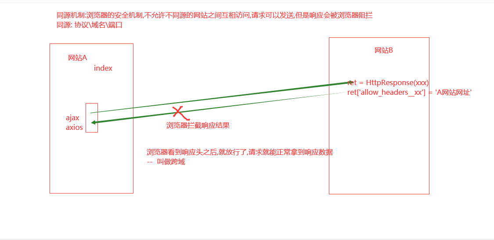

[TOC]


# 4. 通过axios实现数据请求

vue.js默认没有提供ajax功能的。

所以使用vue的时候，一般都会使用axios的插件来实现ajax与后端服务器的数据交互。

注意，axios本质上就是javascript的ajax封装，所以会被同源策略限制。

下载地址：

```
https://unpkg.com/axios@0.18.0/dist/axios.js
https://unpkg.com/axios@0.18.0/dist/axios.min.js

```

axios提供发送请求的常用方法有两个：axios.get() 和 axios.post() 。

增   post

删   delete

改   put

查   get  

```javascript
	// 发送get请求
    // 参数1: 必填，字符串，请求的数据接口的url地址，例如请求地址：http://www.baidu.com?id=200
    // 参数2：可选，json对象，要提供给数据接口的参数
    // 参数3：可选，json对象，请求头信息
	axios.get('服务器的资源地址',{ // http://www.baidu.com
    	params:{
    		参数名:'参数值', // id: 200,
    	}
    
    }).then(function (response) { // 请求成功以后的回调函数
    		console.log("请求成功");
    		console.log(response);
    
    }).catch(function (error) {   // 请求失败以后的回调函数
    		console.log("请求失败");
    		console.log(error.response);
    });

	// 发送post请求，参数和使用和axios.get()一样。
    // 参数1: 必填，字符串，请求的数据接口的url地址
    // 参数2：必填，json对象，要提供给数据接口的参数,如果没有参数，则必须使用{}
    // 参数3：可选，json对象，请求头信息
    axios.post('服务器的资源地址',{
    	username: 'xiaoming',
    	password: '123456'
    },{
        responseData:"json",
    })
    .then(function (response) { // 请求成功以后的回调函数
      console.log(response);
    })
    .catch(function (error) {   // 请求失败以后的回调函数
      console.log(error);
    });

	
	// b'firstName=Fred&lastName=Flintstone'
```


### 4.2.1 数据接口

数据接口，也叫api接口，表示`后端提供`操作数据/功能的url地址给客户端使用。

客户端通过发起请求向服务端提供的url地址申请操作数据【操作一般：增删查改】

同时在工作中，大部分数据接口都不是手写，而是通过函数库/框架来生成。





### 4.2.3 ajax的使用

ajax的使用必须与服务端程序配合使用，但是目前我们先学习ajax的使用，所以暂时先不涉及到服务端python代码的编写。因此，我们可以使用别人写好的数据接口进行调用。

jQuery将ajax封装成了一个函数$.ajax()，我们可以直接用这个函数来执行ajax请求。

| 接口         | 地址                                                         |
| ------------ | ------------------------------------------------------------ |
| 天气接口     | http://wthrcdn.etouch.cn/weather_mini?city=城市名称          |
| 音乐接口搜索 | http://tingapi.ting.baidu.com/v1/restserver/ting?method=baidu.ting.search.catalogSug&query=歌曲标题 |
| 音乐信息接口 | http://tingapi.ting.baidu.com/v1/restserver/ting?method=baidu.ting.song.play&songid=音乐ID |


编写代码获取接口提供的数据：

jQ版本

```html
<!DOCTYPE html>
<html lang="en">
<head>
    <meta charset="UTF-8">
    <title>Title</title>
    <script src="js/jquery-1.12.4.js"></script>
    <script>
    $(function(){
        $("#btn").on("click",function(){
            $.ajax({
                // 后端程序的url地址
                url: 'http://wthrcdn.etouch.cn/weather_mini',
                // 也可以使用method，提交数据的方式，默认是'GET'，常用的还有'POST'
                type: 'get', 
                dataType: 'json',  // 返回的数据格式，常用的有是'json','html',"jsonp"
                data:{ // 设置发送给服务器的数据，如果是get请求，也可以写在url地址的?后面
                    "city":'北京'
                }
                
            })
            .done(function(resp) {     // 请求成功以后的操作,新的ajax是这样写的，之前是通过属性success:function(){}的形式来写的
                console.log(resp);
            })
            .fail(function(error) {    // 请求失败以后的操作 error:function(){}
                console.log(error);
            });
        });
    })
    </script>
</head>
<body>
<button id="btn">点击获取数据</button>
</body>
</html>
```

vue版本：

```html
<!DOCTYPE html>
<html lang="en">
<head>
    <meta charset="UTF-8">
    <title>Title</title>
    <script src="js/vue.js"></script>
    <script src="js/axios.js"></script>
</head>
<body>
    <div id="app">
        <input type="text" v-model="city">
        <button @click="get_weather">点击获取天气</button>
    </div>
    <script>
        let vm = new Vue({
            el:"#app",
            data:{
                city:"",
            },
            methods:{
                get_weather(){
                    // http://wthrcdn.etouch.cn/weather_mini?city=城市名称
                    axios.get("http://wthrcdn.etouch.cn/weather_mini?city="+this.city)
                        .then(response=>{
                            console.log(response);

                        }).catch(error=>{
                            console.log(error.response)
                    });
                }
            }
        })
    </script>
</body>
</html>
```


总结：

```javascript
1. 发送ajax请求，要通过$.ajax()，参数是对象，里面有固定的参数名称。
   $.ajax({
     "url":"数据接口url地址",
     "method":"http请求方式，前端只支持get和post",
     "dataType":"设置服务器返回的数据格式，常用的json，html，jsonp，默认值就是json",
     // 要发送给后端的数据参数，post时，数据必须写在data，get可以写在data,也可以跟在地址栏?号后面
     "data":{
       "数据名称":"数据值",
     }
   }).then(function(resp){ // ajax请求数据成功时会自动调用then方法的匿名函数
     console.log( resp ); // 服务端返回的数据
   }).fail(function(error){ // ajax请求数据失败时会自动调用fail方法的匿名函数
     console.log( error );
   });
   
2. ajax的使用往往配合事件/钩子操作进行调用。
```


### 4.2.4 同源策略

同源策略，是浏览器为了保护用户信息安全的一种安全机制。所谓的同源就是指代通信的两个地址（例如服务端接口地址与浏览器客户端页面地址）之间比较，是否协议、域名(IP)和端口相同。不同源的客户端脚本[javascript]在没有明确授权的情况下，没有权限读写对方信息。


ajax本质上还是javascript，是运行在浏览器中的脚本语言，所以会被受到浏览器的同源策略所限制。

| 前端地址：`http://www.oldboy.cn/index.html` | 是否同源 | 原因                     |
| ------------------------------------------- | -------- | ------------------------ |
| `http://www.oldboy.cn/user/login.html`      | 是       | 协议、域名、端口相同     |
| `http://www.oldboy.cn/about.html`           | 是       | 协议、域名、端口相同     |
| `https://www.oldboy.cn/user/login.html`     | 否       | 协议不同 ( https和http ) |
| `http:/www.oldboy.cn:5000/user/login.html`  | 否       | 端口 不同( 5000和80)     |
| `http://bbs.oldboy.cn/user/login.html`      | 否       | 域名不同 ( bbs和www )    |

同源策略针对ajax的拦截，代码：

```html
<!DOCTYPE html>
<html lang="en">
<head>
    <meta charset="UTF-8">
    <title>Title</title>
    <script src="js/vue.js"></script>
    <script src="js/axios.js"></script>
</head>
<body>
    <div id="app">
        <button @click="get_music">点击获取天气</button>
    </div>
    <script>
        let vm = new Vue({
            el:"#app",
            data:{},
            methods:{
                get_music(){
                    axios.get("http://tingapi.ting.baidu.com/v1/restserver/ting?method=baidu.ting.search.catalogSug&query=我的中国心")
                        .then(response=>{
                            console.log(response);

                        }).catch(error=>{
                            console.log(error.response)
                    });
                }
            }
        })
    </script>
</body>
</html>
```


上面代码运行错误如下：

```
Access to XMLHttpRequest at 'http://tingapi.ting.baidu.com/v1/restserver/ting?method=baidu.ting.search.catalogSug&query=%E6%88%91%E7%9A%84%E4%B8%AD%E5%9B%BD%E5%BF%83' from origin 'http://localhost:63342' has been blocked by CORS policy: No 'Access-Control-Allow-Origin' header is present on the requested resource.
```

上面错误，关键词：Access-Control-Allow-Origin

只要出现这个关键词，就是访问受限。出现同源策略的拦截问题。


### 4.2.5 ajax跨域(跨源)方案之CORS

​      CORS是一个W3C标准，全称是"跨域资源共享"，它允许浏览器向跨源的后端服务器发出ajax请求，从而克服了AJAX只能同源使用的限制。

​      实现CORS主要依靠<mark>后端服务器中响应数据中设置响应头信息返回</mark>的。


django的视图

```python
def data(request):
	info = {'name': '世元', 'age': 18}
	ret = JsonResponse(info)
	# ret['Access-Control-Allow-Origin'] = 'http://127.0.0.1:8000'  #允许该地址的请求正常获取响应数据
    # ret['Access-Control-Allow-Origin'] = 'http://127.0.0.1:8000,http://127.0.0.1:8002'
	ret['Access-Control-Allow-Origin'] = '*' #允许所有地址请求都能拿到数据
    
	return ret
```


# 5. 组件化开发

## 5.1 组件[component]

组件（Component）是自定义封装的功能。在前端开发过程中，经常出现多个网页的功能是重复的，而且很多不同的网站之间，也存在同样的功能。


而在网页中实现一个功能，需要使用html定义功能的内容结构，使用css声明功能的外观样式，还要使用js来定义功能的特效，因此就产生了把一个功能相关的[HTML、css和javascript]代码封装在一起组成一个整体的代码块封装模式，我们称之为“组件”。


所以，组件就是一个html网页中的功能，一般就是一个标签，标签中有自己的html内容结构，css样式和js特效。

这样，前端人员就可以在开发时，只需要书写一次代码，随处引入即可使用。

我们在进行vue开发的时候，还记得我们自己创建的vm对象吗，这个vm对象我们称为一个大组件，根组件(页面上叫Root)，在一个网页的开发中，根据网页上的功能区域我们又可以细分成其他组件，或称为子组件


组件有两种：默认组件[全局组件] 和 单文件组件[局部组件]

### 5.1.1局部组件

三步：声子、用子、挂子

注意:每个组件中的template对应的标签,都必须有一个外层标签包裹

```vue
<!DOCTYPE html>
<html lang="en">
<head>
	<meta charset="UTF-8">
	<title>todolist</title>

</head>
<body>
	<div id="app">
		<!-- 3.使用子组件  用子 -->
<!--		<xx></xx>-->
<!--		<xx2></xx2>-->
	<Vheader></Vheader>
    
	<xxx></xxx>
	<Kk></Kk>
<!--	content  header footer aside section nav H5有一些新标签,注意,组件名称尽量不要和标签名称冲突 -->
	</div>
</body>
<script src="vue.js"></script>
<script src="axios.js"></script>
<script>
	// 组件化开发(将页面的每块功能,单独封装为一个组件,哪个页面用哪些组件,就直接拿到这几个组件,拼到页面上展示)
	// 1.声明子组件  声子
	let Vheader = {
		data(){
			return {
				nav_list:['个人中心','登录','注册']
			}
		},
		template:'<h1>{{nav_list}}</h1>',


	};

	let xxx = {
		data(){
			return {
				content_list:['xxx','ooo',]
			}
		},
		template:'<h1 style="color:red;">{{content_list}}</h1>',


	};

	// 全局组件  不需要挂载,直接使用
	Vue.component('Kk',{
		data(){
			return {
				name:'全局组件!!!'
			}
		},
		template:'<h1 style="color:tan;">{{name}}</h1>',

	})


	let vm  = new Vue({
		el:'#app',
		data(){
			return {
				data:'',
			}
		},

		created(){

		},
		components:{
			Vheader,  //2.挂载子组件  挂子
			// Content:Content,
			xxx,   // 键和值相同,就可以简写
		}


	})


</script>
</html>
```


### 5.1.2 默认组件(全局组件)

直接看代码，局部组件使用时需要挂载，全局组件使用时不需要挂载。那么他们两个什么时候用呢，局部组件就在某个局部使用的时候，全局组件是大家公用的，或者说每个页面都有这么一个功能的时候，在哪里可能都会用到的时候。

```html
<div id="app">
    <Kk></Kk>

</div>

<script>
    	// 全局组件  不需要挂载,直接使用
	Vue.component('Kk',{
		data(){
			return {
				name:'全局组件!!!'
			}
		},
		template:'<h1 style="color:tan;">{{name}}</h1>',

	})


    var vm = new Vue({
        el:"#app",
        data:{

        }
    })
</script>
```


## 5.2 组件传值


通过prop属性进行传值

### 5.2.1 父组件往子组件传值 


两步：　　

​		1.父组件在使用子组件时要定义自定义的属性:比如:`<Vheader :ff="num"></Vheader>`动态传值

​			静态传值:`<Vheader ff="123"></Vheader>`

​		2.在子组件中使用props属性声明:比如:props:['ff', ]，然后子组件就可以将ff作为一个数据属性来使用了,比如:

```html
		template:`<div>
					<h1>{{nav_list}}</h1>
					<h2>{{nav_list}}</h2>
					<h4 style="color:green;">{{ff}}</h4>

				</div>`,
```


　　

看示例：

```vue
<!DOCTYPE html>
<html lang="en">
<head>
	<meta charset="UTF-8">
	<title>todolist</title>

</head>
<body>
	<div id="app">
		<!-- 3.使用子组件  用子 -->
<!--		<xx></xx>-->
<!--		<xx2></xx2>-->
	<App></App>
<!--	content  header footer aside section nav H5有一些新标签,注意,组件名称尽量不要和标签名称冲突 -->
	</div>
</body>
<script src="vue.js"></script>
<script src="axios.js"></script>
<script>

    // 父组件往子组件传值:


	let Vheader = {
		data(){
			return {
				nav_list:['个人中心','登录','注册','username']
			}
		},
		template:`<div>
					<h1>{{nav_list}}</h1>
					<h2>{{nav_list}}</h2>
					<h4 style="color:green;">{{ff}}</h4>

				</div>`,

		props:['ff', ],

	};


	let xxx = {
		data(){
			return {
				content_list:['xxx','ooo',]
			}
		},
		template:'<h1 style="color:red;">{{content_list}}</h1>',


	};

	let App = {
		data(){
			return {
				'xxx':'ooo',
				num:1000,
			}
		},
		// <Vheader ff="123"></Vheader> 静态传值
		template:
				`
				<div class="app">
					<Vheader :ff="num"></Vheader>
					<xxx></xxx>

				</div>

				`,
		components: {
			Vheader,
			xxx,
		}
	}


	let vm  = new Vue({
		el:'#app',

		components:{
			App,
		}


	})


</script>
</html>
```


使用父组件传递数据给子组件时, 注意一下几点:

1. 传递数据是变量,则需要在属性左边添加冒号.

   传递数据是变量,这种数据称之为"动态数据传递"

   传递数据不是变量,这种数据称之为"静态数据传递"

2. 父组件中修改了数据,在子组件中会被同步修改,但是,子组件中的数据修改了,是不是影响到父组件中的数据.

   这种情况,在开发时,也被称为"单向数据流"


```html
<!DOCTYPE html>
<html lang="en">
<head>
	<meta charset="UTF-8">
	<title>todolist</title>

</head>
<body>
	<div id="app">
		<!-- 3.使用子组件  用子 -->
<!--		<xx></xx>-->
<!--		<xx2></xx2>-->
	<App></App>
<!--	content  header footer aside section nav H5有一些新标签,注意,组件名称尽量不要和标签名称冲突 -->
	</div>
</body>
<script src="vue.js"></script>
<script src="axios.js"></script>
<script>

    // 父组件往子组件传值:


	let Vheader = {
		data(){
			return {
				nav_list:['个人中心','登录','注册','username']
			}
		},
		template:`<div>
					<h1>{{nav_list}}</h1>
					<h2>{{nav_list}}</h2>
					<h4 style="color:green;">{{ff}}</h4>
					<input type="text" v-model="ff">  #修改input标签的值,不会影响父级标签的数据

				</div>`,

		props:['ff', ],

	};


	let xxx = {
		data(){
			return {
				content_list:['xxx','ooo',]
			}
		},
		template:'<h1 style="color:red;">{{content_list}}</h1>',


	};

	let App = {
		data(){
			return {
				'xxx':'ooo',
				num:1001,
			}
		},
		// <Vheader ff="123"></Vheader> 静态传值
		template:
				`
				<div class="app">
					<Vheader :ff="num"></Vheader>
					<xxx></xxx>
					<h3 style="color:blue;">{{num}}</h3>

				</div>

				`,
		components: {
			Vheader,
			xxx,
		}
	}


	let vm  = new Vue({
		el:'#app',

		components:{
			App,
		}


	})


</script>
</html>
```


### 5.2.2 子组件父组件传值 

两步：

　　a.子组件中使用this.$emit('fatherHandler',val);fatherHandler是父组件中使用子组件的地方添加的绑定自定义事件，**注意，如果fatherHandler报错了，那么可能是你的vue版本不支持自定义键名称fatherHandler中有大写字母，所以我们改成father-handler或者直接就全部小写就可以了**

```vue
<Vheader @fatherHandler="appFatherHandler"></Vheader> 
```

　　b.父组件中的methods中写一个自定义的事件函数：appFatherHandler(val){}，在函数里面使用这个val，这个val就是上面子组件传过来的数据

 　看代码：

```vue
<!DOCTYPE html>
<html lang="en">
<head>
	<meta charset="UTF-8">
	<title>todolist</title>

</head>
<body>
	<div id="app">

	<App></App>
	</div>
</body>
<script src="vue.js"></script>
<script src="axios.js"></script>
<script>

	let Vheader = {
		data(){
			return {
				nav_list:['个人中心','登录','注册','username'],
				header_num:80,
			}
		},
		template:`<div>
					<h1>{{nav_list}}</h1>
					<h2>{{nav_list}}</h2>
					<button @click="zouni">go</button>
				</div>`,

		methods: {
			zouni(){
				// 给父组件传值
				this.$emit('ffunc',this.header_num);

			}
		}

	};


	let xxx = {
		data(){
			return {
				content_list:['xxx','ooo',]
			}
		},
		template:'<h1 style="color:red;">{{content_list}}</h1>',


	};

	let App = {
		data(){
			return {
				'xxx':'ooo',
				num:1001,
				son_data:'',
			}
		},
		// <Vheader ff="123"></Vheader> 静态传值
		template:
				`
				<div class="app">
					<!-- 父组件使用子组件时,写上一个自定义事件 -->
					<Vheader @ffunc="recv_data"></Vheader>
					<xxx></xxx>
					<h3>{{son_data}}</h3>

				</div>

				`,
		components: {
			Vheader,
			xxx,
		},
		methods:{
			recv_data(val){
				this.son_data = val;
			}
		}
	}


	let vm  = new Vue({
		el:'#app',

		components:{
			App,
		}


	})


</script>
</html>
```


### 5.2.3 平行组件传值

什么是平行组件，看图


看代码 :声明两个全局组件T1和T2，T1组件将数据传送给T2组件

```vue
<!DOCTYPE html>
<html lang="en">
<head>
	<meta charset="UTF-8">
	<title>todolist</title>

</head>
<body>
	<div id="app">

	<App></App>
	</div>
</body>
<script src="vue.js"></script>
<script src="axios.js"></script>
<script>
	// 1 先声明一个公交车
	let bus = new Vue();

	Vue.component('t1',{
		data(){
			return {
				msg:'hello',
				num:200,
			}
		},
		template:
				`
				<div class="t1">
					<h1>{{msg}}</h1>
					<button @click="kk">zouni</button>
				</div>
				`,
		
		// created方法中的bus.$emit('xxx', this.num);不能正常放值
		// created(){
		//	
		// 	// 2. 往公交车上放值
		// 	bus.$emit('xxx', this.num);
		// },
		
		methods: {
			kk(){
				bus.$emit('xxx', this.num);
			}
		}

	});
	Vue.component('t2',{
		data(){
			return {
				msg:'hello2',
				num:1002,
				t1_num:'',
			}
		},
		template:
				`
				<div class="t2">
					<h1>{{msg}}</h1>
					<h2>{{t1_num}}</h2>
				</div>
				`,

		created(){

			bus.$on('xxx',(val)=>{
				// console.log('111111');
				console.log(val);
				this.t1_num = val;
			});


		}
	})


	let App = {
		data(){
			return {
				'xxx':'ooo',
				num:1001,
				son_data:'',
			}
		},
		// <Vheader ff="123"></Vheader> 静态传值
		template:
				`
				<div class="app">

					<h3>{{son_data}}</h3>
					<t1></t1>
					<t2></t2>
				</div>

				`,

		methods:{
			recv_data(val){
				this.son_data = val;
			}
		}
	}


	let vm  = new Vue({
		el:'#app',

		components:{
			App,
		}


	})


</script>
</html>
```


# 6. vue-router的使用

## 6.1 介绍

vue就是我们前面学习的vue基础，vue + vue-router 主要用来做SPA(Single Page Application)，单页面应用

为什么要使用单页面应用呢？因为传统的路由跳转，如果后端资源过多，会导致页面出现'白屏现象'，所以我们希望让前端来做路由，在某个生命周期的钩子函数中，发送ajax来请求数据，进行数据驱动，之前比如我们用django的MTV模式，我们是将后端的数据全部渲染给了模板，然后模板再发送给前端进行浏览器页面的渲染，一下将所有的数据都给了页面，而我们现在使用vue，我可以在组件的钩子函数中发送对应的ajax请求去获取对应的数据，而不是裤衩一下子就把数据都放到页面上了，单页面应用给我们提供了很多的便利，说起来大家可能没有什么切实的体会，来，给大家推荐一个[稀土掘金网站](https://juejin.im/)，这个网站就是一个单页面应用，是一个开发者技术社区网站，里面的资源会有很多，看样子：

　　　　

　　这样的网站我们通过django是可以来完成页面的渲染的，模板渲染嘛，但是这个论坛的数据资源有很多，我们通过django的MTV模式是一下子就将数据全部放到页面里面了，那么页面通过浏览器渲染的时候，浏览器可能没有那么快渲染出来，会出现几秒钟的白屏现象，也就是说几秒钟之后用户才看到页面的内容，这样体验起来就不好，为了用户体验好，就用到了我们说的单页面应用，django模板渲染做大型应用的时候，也就是页面很复杂，数据量很大的页面的时候，是不太合适的，当然如果你够nb，你也可以优化，但是一般它比较适合一些页面数据比较小的应用。

　　那么解释一下什么是单页应用，看下图：(react、angular也都是做单页面应用，很多大型的网站像网易云音乐，豆瓣等都是react写的单页面应用)

　　　　　　

　　　　

　　vue + vue-router就是完成单页面应用的，vue-router(路由)是vue的核心插件


下面我们来下载一下vue-router，[文档地址](https://router.vuejs.org/zh/)，下载vue-router的cnd链接地址：https://unpkg.com/vue-router/dist/vue-router.js

官网简单操作：

```vue
// 0. 如果使用模块化机制编程，导入Vue和VueRouter，要调用 Vue.use(VueRouter)

// 1. 定义 (路由) 组件。
// 下面两个组件可以从其他文件 import 进来
const Foo = { template: '<div>foo</div>' }
const Bar = { template: '<div>bar</div>' }

// 2. 定义路由
// 每个路由应该映射一个组件。 其中"component" 可以是
// 通过 Vue.extend() 创建的组件构造器，
// 或者，只是一个组件配置对象。
// 我们晚点再讨论嵌套路由。
const routes = [
  { path: '/foo', component: Foo },
  { path: '/bar', component: Bar }
]

// 3. 创建 router 实例，然后传 `routes` 配置
// 你还可以传别的配置参数, 不过先这么简单着吧。
const router = new VueRouter({
  routes // (缩写) 相当于 routes: routes
})

// 4. 创建和挂载根实例。
// 记得要通过 router 配置参数注入路由，
// 从而让整个应用都有路由功能
const app = new Vue({
  router
}).$mount('#app')

// 现在，应用已经启动了！
```


使用流程

```html
1 下载并引入vue-router的js文件: https://unpkg.com/vue-router/dist/vue-router.js
2 创建路由规则(哪个路径对应哪个组件)
	const routes = [
	  { path: '/home', component: Home },
	  { path: '/course', component: Course }
	]
3 创建对应的组件(Home\Course)
	let Home = {
		data(){
			return {
				msg:'我是home组件',
			}
		},
		template:
				`
					<div class="home">
						<h1>{{msg}}</h1>

					</div>
				`
	};
	
	let Course = {
		data(){
			return {
				msg:'我是Course组件',
			}
		},
		template:
				`
					<div class="course">
						<h1>{{msg}}</h1>

					</div>
				`

	}
4 创建vueRouter对象,并将路由规则交给这个对象
	let router = new VueRouter({
		routes,
	})
5 在vue对象中挂载一下router对象
		let vm  = new Vue({
            el:'#app',
            router,  //挂载
            components:{
                App,
            }


        })

6 创建router-link标签来指定路由
		let App = {
		data(){
			return {

				num:100,

			}
		},

		template:
				`
				<div class="app">

					<router-link to="/home">首页</router-link>
					<router-link to="/course">课程页</router-link>


					<router-view></router-view>
				</div>

				`,

		methods:{

		}
	}
7 写路由出口 router-view
```


　　　　

## 6.2 简单示例

示例： 通过不同的路径访问到不同的组件

```vue
<!DOCTYPE html>
<html lang="en">
<head>
	<meta charset="UTF-8">
	<title>todolist</title>

</head>
<body>
	<div id="app">

		<App></App>
	</div>
</body>
<script src="vue.js"></script>
<script src="axios.js"></script>
<script src="vue-router.js"></script>

<script>

	let Home = {
		data(){
			return {
				msg:'我是home组件',
			}
		},
		template:
				`
					<div class="home">
						<h1>{{msg}}</h1>

					</div>
				`

	};
	let Course = {
		data(){
			return {
				msg:'我是Course组件',
			}
		},
		template:
				`
					<div class="course">
						<h1>{{msg}}</h1>

					</div>
				`

	}


	const routes = [
	  { path: '/home', component: Home },
	  { path: '/course', component: Course }
	]

	let router = new VueRouter({
		routes,
	})

	let App = {
		data(){
			return {

				num:100,

			}
		},

		template:
				`
				<div class="app">

					<router-link to="/home">首页</router-link>
					<router-link to="/course">课程页</router-link>


					<router-view></router-view>
				</div>

				`,

		methods:{

		}
	}


	let vm  = new Vue({
		el:'#app',
		router,
		components:{
			App,
		}


	})


</script>
</html>
```


# 7. Vue自动化工具（Vue-cli）

前面学习了普通组件以后，接下来我们继续学习单文件组件则需要提前先安装准备一些组件开发工具。否则无法使用和学习单文件组件。

一般情况下，单文件组件，我们运行在 自动化工具vue-CLI中，可以帮我们编译单文件组件。所以我们需要在系统中先搭建vue-CLI工具，

官网：https://cli.vuejs.org/zh/


Vue CLI 需要 [Node.js](https://nodejs.org/) 8.9 或更高版本 (推荐 8.11.0+)。你可以使用 [nvm](https://github.com/creationix/nvm) 或 [nvm-windows](https://github.com/coreybutler/nvm-windows)在同一台电脑中管理多个 Node 版本。


nvm工具的下载和安装：   https://www.jianshu.com/p/d0e0935b150a

​                                              https://www.jianshu.com/p/622ad36ee020

安装记录:

打开:https://github.com/coreybutler/nvm-windows/releases


常用的nvm命令

nvm list   # 列出目前在nvm里面安装的所有node版本
nvm install node版本号      # 安装指定版本的node.js

例子：nvm install **14.15.1** 

nvm uninstall node版本号    # 卸载指定版本的node.js
nvm use node版本号          # 切换当前使用的node.js版本	


如果使用nvm工具，则直接可以不用自己手动下载，如果使用nvm下载安装 node的npm比较慢的时候，可以修改nvm的配置文件(在安装根目录下)

```
# settings.txt
root: C:\tool\nvm    [这里的目录地址是安装nvm时自己设置的地址,要根据实际修改]
path: C:\tool\nodejs
arch: 64
proxy: none
node_mirror: http://npm.taobao.org/mirrors/node/ 
npm_mirror: https://npm.taobao.org/mirrors/npm/
```


## 7.1 安装node.js

Node.js是一个新的后端(后台)语言，它的语法和JavaScript类似，所以可以说它是属于前端的后端语言，后端语言和前端语言的区别：

- 运行环境：后端语言一般运行在服务器端，前端语言运行在客户端的浏览器上
- 功能：后端语言可以操作文件，可以读写数据库，前端语言不能操作文件，不能读写数据库。

我们一般安装LTS(长线支持版本)：

下载地址：https://nodejs.org/en/download/【上面已经安装了nvm，那么这里不用手动安装了】


node.js的版本有两大分支：

官方发布的node.js版本：0.xx.xx 这种版本号就是官方发布的版本

社区发布的node.js版本：xx.xx.x  就是社区开发的版本


Node.js如果安装成功，可以查看Node.js的版本,在终端输入如下命令：

```
node -v

```


## 7.2 npm

在安装node.js完成后，在node.js中会同时帮我们安装一个npm包管理器npm。我们可以借助npm命令来安装node.js的包。这个工具相当于python的pip管理器。

```
npm install -g 包名              # 安装模块   -g表示全局安装，如果没有-g，则表示在当前项目安装
npm list                        # 查看当前目录下已安装的node包
npm view 包名 engines            # 查看包所依赖的Node的版本 
npm outdated                    # 检查包是否已经过时，命令会列出所有已过时的包
npm update 包名                  # 更新node包
npm uninstall 包名               # 卸载node包
npm 命令 -h                      # 查看指定命令的帮助文档
```


## 7.3 安装Vue-cli

```
npm install -g vue-cli
npm install -g vue-cli --registry https://registry.npm.taobao.org
```

如果安装速度过慢，一直超时，可以考虑切换npm镜像源：http://npm.taobao.org/

指令：

```js

 1     //临时使用
 2     npm install jquery --registry https://registry.npm.taobao.org
 3 
 4     //可以把这个选型配置到文件中，这样不用每一次都很麻烦
 5     npm config set registry https://registry.npm.taobao.org
 6 
 7     //验证是否配置成功 
 8     npm config list 或者 npm config get registry
 9 
10     //在任意目录下都可执行,--global是全局安装，不可省略
11     npm install --global cnpm 或者 npm install -g cnpm --registry=https://registry.npm.taobao.org
12 
13     //安装后直接使用
14     cnpm install jquery

```

npm和cnpm介绍

参考博客： https://blog.csdn.net/jack_bob/article/details/80644376


安装vue-cli

nvm是node.js的版本管理工具

1 安装node.js  自带npm

2 通过npm 安装vue-cli  它的运行需要依赖node.js的环境


## 7.4 使用Vue-CLI初始化创建项目

### 7.4.1 生成项目目录

使用vue自动化工具可以快速搭建单页应用项目目录。

该工具为现代化的前端开发工作流提供了开箱即用的构建配置。只需几分钟即可创建并启动一个带热重载、保存时静态检查以及可用于生产环境的构建配置的项目：

```
// 生成一个基于 webpack 模板的新项目
vue init webpack 项目名
例如：
vue init webpack myproject


// 启动开发服务器 ctrl+c 停止服务
cd myproject
npm run dev           # 运行这个命令就可以启动node提供的测试http服务器
```


那么访问一下命令执行完成后提示出来的网址就可以看到网站了：http://localhost:8080/


### 7.4.2 项目目录结构

src   主开发目录，要开发的单文件组件全部在这个目录下的components目录下

static 静态资源目录，所有的css，js，图片等文件放在这个文件夹

dist项目打包发布文件夹，最后要上线单文件项目文件都在这个文件夹中[后面打包项目,让项目中的vue组件经过编译变成js 代码以后,dist就出现了]

node_modules目录是node的包目录，

config是配置目录，

build是项目打包时依赖的目录

src/router   路由,后面需要我们在使用Router路由的时候,自己声明.


### 7.4.3 项目执行流程图


整个项目是一个主文件index.html,index.html中会引入src文件夹中的main.js,main.js中会导入顶级单文件组件App.vue,App.vue中会通过组件嵌套或者路由来引用components文件夹中的其他单文件组件。


