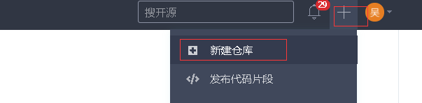
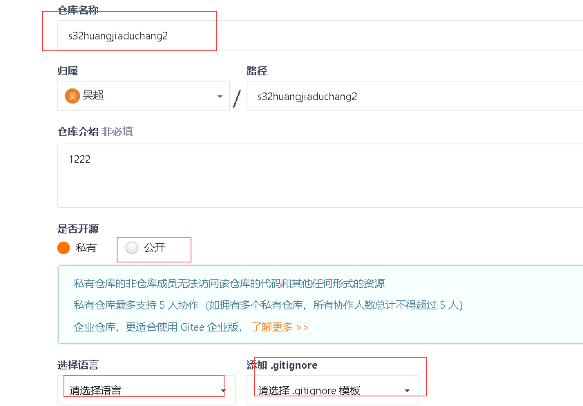
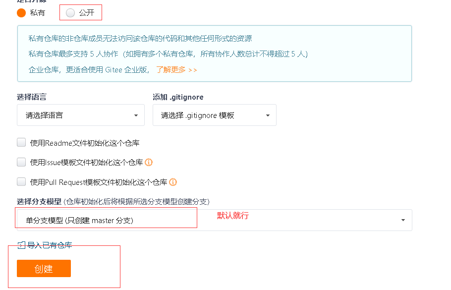
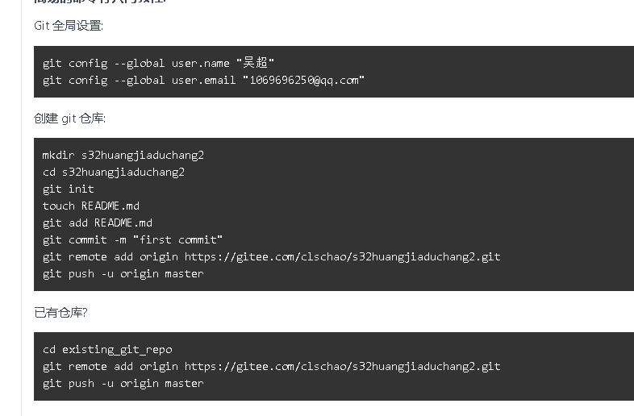

## 3 引入ElementUI

对于前端页面布局,我们可以使用一些开源的UI框架来配合开发,Vue开发前端项目中,比较常用的就是ElementUI了.

ElementUI是饿了么团队开发的一个UI组件框架,这个框架提前帮我们提供了很多已经写好的通用模块,我们可以在Vue项目中引入来使用,这个框架的使用类似于我们前面学习的bootstrap框架,也就是说,我们完全可以把官方文档中的组件代码拿来就用,有定制性的内容,可以直接通过样式进行覆盖修改就可以了.

/vue04/assets/1552501300174.png)

中文官网：http://element-cn.eleme.io/#/zh-CN

文档快速入门：http://element-cn.eleme.io/#/zh-CN/component/quickstart


### 3.1 快速安装ElementUI

项目根目录执行以下命令:

```shell
npm i element-ui -S --registry https://registry.npm.taobao.org
```

上面的命令等同于:

```shell
npm install element-ui --save
```

执行命令效果:

/vue04/assets/1556417812874.png)


### 3.2 配置ElementUI到项目中

在main.js中导入ElementUI,并调用,代码如下:

```javascript
// elementui导入
import ElementUI from 'element-ui';
import 'element-ui/lib/theme-chalk/index.css';  // 需要import引入一下css文件,和我们的link标签引入是一个效果,而import .. from .. 是配合export default来使用的
// 调用插件
Vue.use(ElementUI);
```

效果:

/vue04/assets/1552501156871.png)

成功引入了ElementUI以后,接下来我们就可以开始进行前端页面开发,首先是首页.


# Git相关

## Git指令总结

```shell
git init    # 初始化本地git仓库,需要被管理的代码文件或者目录,都放到本地git仓库中
git status    # 查看本地仓库中的文件和文件夹的状态
git add 文件名称(或者.)    # 通过git管理某个文件或者文件及目录

配置用户名和邮箱
$ git config --global user.name <用户名>
$ git config --global user.email <邮箱地址>
例如:
$ git config --global user.name "刘子龙"
$ git config --global user.email "liuzl940914@163.com"

git commit -m '版本描述'    # 生成版本
git log    # 查看版本,包含版本号
git reset --hard 版本号(前7位)    # 将代码回滚到某个版本的状态
git reflog    # 查看所有版本(包括回滚记录)
```


## Git进阶

### Git三大区域

介绍: 工作区(写代码的地方)-git add暂存区(临时存储)-git commit本地库(历史版本)

  

 Git的强大之处,能够让我们在任意版本之间来回切换

 ```shell
 git checkout -- 文件名    # 将文件从已修改的工作区回滚到未修改的状态
 ```

 如果我们将修改的文件已经添加到了暂存区了,又怎么回滚呢?

 ```shell
 git reset HEAD 文件名
 ```

 如果想让他在回到未修改时的状态,那么就又用到了我们那个git checkout -- 文件名,那个指令了


 ### Git分支

 分支可以给使用者提供多个开发环境,也就是说可以将你的工作从主线中分离出来,以免影响开发主线,等分支的代码开发完之后,在合并到主线代码上,就比如说,我们写了一个毕业论文,大致的流程写完了,但是我们可能觉得某些地方写的太少了(添加新的功能),需要丰富一下,或者有些地方可能写的有问题需要调整一下(之前的代码有bug,需要修改),那么我们怎么做呢,是不是会复制一份这个论文,然后再修改,改完之后如果没有什么问题,就将改完之后的作为了最新版本(分支上添加了新功能或者修复了bug,然后进行分支合并).

 大家在这里先不用去考虑公司里面是怎么使用git来进行工作的,我们首先来看看,如果你在自己的电脑上开发程序,用git是怎么个流程,怎样开发分支,分支是个什么养殖?

 比如,我们现在的代码开发到了第三个版本,之前我们没有说什么分支的歹念,其实我们开发代码的时候,默认的分支叫做主分支(master分支),只是我们一直还不知道.

  


  ### 指令总结

  ```shell
git branch    # 查看当前分支
git branch dev    # 创建一个名称为dev的分支
git checkout dev    # 将工作切换到dev分支上

git checkout -b dev    # 创建并切换到dev分支上,和上面两个指令的效果一样

git checkout master
git merge dev    # 分支合并 -- 首先切换到master分支,然后再master分支上执行merge指令来合并dev分支的代码

git branch -d dev    # 删除dev分支 
```


### 分支代码冲突问题

```python
比如: dev在index.html文件的第7行加了一个行代码<li>打赏</li>,并且提交了版本,master上在没有合并dev分支时,又在index.html文件的第7行加上了一行代码:<li>上门</li>,并且提交了版本,那么当master分支去合并dev分支时,就会出现代码冲突的问题(同一文件的同一行出现了不同的代码,就是冲突)
报错内容如下:
    Auto-merging index.html
    CONFLICT(content):Merge conflict in index.html
    Automatic merge failed;fix conflicts and then commit the result.
解决冲突:git发现冲突之后,就在冲突的文件位置做上如下标识
    <<<<<<< HEAD   表示当前分支代码
    <li>上门!</li>
    =======
    <li>打赏</li>
    >>>>>>> DEV   表示被合并的dev分支代码
```

远程仓库管理 github gitlab 码云 CSDN ...

1.注册一个码云账号

2.创建仓库



3.仓库信息填写





创建完仓库就提示如何将本地仓库连接到远程仓库中,然后如何将本地代码推送到远程仓库

