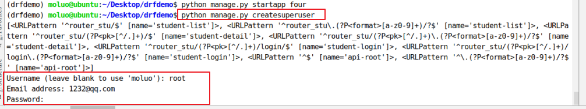

[TOC]

为了方便接下来的学习,我们创建一个新的子应用 four

```python
python manage.py startapp four
```

因为接下来的功能中需要使用到登录功能,所以我们使用django内置的admin站点并创建一个管理员

```shell
python manage.py createsuperuser
填一下用户名,邮箱和密码
root
1232@qq.com
123
```



创建管理员以后,访问admin站点,先修改站点的语言配置

settings.py

```python
'zh-hans'
```


访问admin,站点效果


# 1. 认证Authentication

可以在配置文件中配置全局默认的认证方案

```python
# from rest_framework import settings中可以看到他默认使用的
# 在settings配置文件中,我们可以进行下面的配置来覆盖默认配置

REST_FRAMEWORK = {
	'DEFAULT_AUTHENTICATION_CLASSES': (
		# 哪个写在前面,优先使用哪个认证
		'rest_framework.authentication.SessionAuthentication',	# session认证,admin后台其实就使用的session认证,其实接口开发开发很少用到session认证,所以我们通过配置可以改为其他认证,比如后面项目里面我们用到的jwt,JSON WEB TOKEN认证,或者一些配合redis的认证
		'rest_framework.authentication.BasicAuthentication',	# 基本认证,工作当中可能一些测试人员会参与的话,他们会将一些认证数据保存在内存当中,然后验证的,我们基本上用不上
	)
}
```

看效果:能够看到我们当前的登录用户了就,其实不配置也能看到,因为我们并没有修改认证系统


也可以在每个视图中通过设置authentication_classess属性来设置,比如说我们很多接口的数据都是可以让别人获取数据的,但是有可能有些接口是调用给别人网站的,有可能到时候我们就需要一些单独的认证了

```python
from rest_framework.authentication import SessionAuthentication, BasicAuthentication
from rest_framework.views import APIView


class ExampleView(APIView):
	# 类属性
	authentication_classes = [SessionAuthentication, BasicAuthentication]	# 也可以写成元组形式的,到时候我们使用我们自己开发的认证组件的时候,就需要自己写一个认证组件类,然后写在列表中来使用
	...
```

认证失败会有两种可能的返回值

- 401 Unauthorized 未认证
- 403 Permission Denied 权限被禁止

示例1: 自定义认证组件

1. 写一个认证类

```python
from rest_framework.authentication import BaseAuthentication
from rest_framework.response import Response
from rest_framework.exceptions import AuthenticationFailed


class Auth(BaseAuthentication):
	def authenticate(self, request):
		# request.session.get('username') = 'chao'

		# 通过条件判断用户登录态,登录成功了,那么返回用户信息,失败了可以报错
		if 1 == 1:
			return 'zhaozhi', 'xx'	# request.user = zhaozhi, request.auth = 'xx'
		else:
			raise AuthenticationFailed('认证失败')
```

全局使用,settings配置文件中使用

```python
REST_FRAMEWORK = {
	'DEFAULT_AUTHENTICATION_CLASSES': (
		...
		'four.utils.auth.APIAuth',	# 类的路径
	),
}
```

局部视图中使用:

```python
from four.utils.authrenzheng import Auth


class StudentView(APIView):
	authentication_classes = [Auth, ]
	def get(self, request):
		print(request.user)	  # zhaozhi
		print(request.auth)	  # xx

		return Response({'msg': 'ok'})
```


# 2. 权限Permissions

权限控制可以限制用户对于视图的访问和对于具体数据对象的访问

- 在执行视图的dispatch()方法前,会先进行视图访问权限的判断
- 在通过get_object()获取具体对象时,会进行模型对象访问权限的判断


### 使用

可以在配置文件中全局设置默认的权限管理类,如:

```python
REST_FRAMEWORK = {
	...
	'DEFAULT_PERMISSION_CLASSES': (
		'rest_framework.permissions.IsAuthenticated',	# 登录状态下才能访问我们的接口,可以通过退出admin后台之后,看一下还能不能访问我们正常的接口就看到效果了
	)
}
```

如果未指明,则采用如下默认配置

```python
from rest_framework import permissions

'DEFAULT_PERMISSION_CLASSES': (
	'rest_framework.permissions.AllowAny',	# 表示任何人都可以进行任何操作,没做限制
)
```

也可以在具体的视图中通过permission_classes属性来设置,如:

```python
from rest_framework.permisssions import IsAuthenticated
from rest_framework.views import APIView


class ExampleView(APIView):
	permission_classes = (IsAuthenticated, )
	...
```


### 提供的权限

- AllowAny 允许所有用户
- IsAuthenticated 仅通过认证的用户


### 举例

```python
from rest_framework.authentication import SessionAuthentication
from rest_framework.permissions import IsAuthenticated
from rest_framework.generics import RetrieveAPIView


class StudentAPIView(RetrieveAPIView):
	queryset = Student.objects.all()
	serializer_class = StudentSerializer
	authentication_classes = [SessionAUthentication]
	permission_classes = [IsAuthenticated]
```


### 自定义权限

如需要自定义权限,需继承rest_framework.permissions.BasePermission父类,并实现以下两个任何一个方法或全部

- `.has_permission(self, request, view)`

  是否可以访问视图,view表示当前视图对象

例如:

在当前子应用下,创建一个权限文件permissions.py中声明自定义权限类:

```python
from rest_framework.permissions import BasePermission


class VIPpermission(BasePermission):
	def has_permission(self, request, view):
		print('看看有没有权限')
		# request.user.role == 'vip'
		return True
		# return False
```

```python
from four.utils.mypermission import VPIpermission


class StudentView(APIView):
	# authentication_classes = [Auth, ]
	permission_classes = [VIPpermission]
	def get(self, request):
		return Response({'msg':'ok'})
```


# 3. 限流Throtting

可以对接口访问的频次进行限制,以减轻服务器压力

一般用于付费购买次数,投票等场景使用


## 使用

可以在配置文件中,使用`DEFAULT_THROTTLE_CLASSES`和`DEFAULT_THROTTLE_RATES`进行全局配置

```python
REST_FRAMEWORK = {
	'DEFAULT_THROTTLE_CLASSES': (
		'rest_framework.throttling.AnonRateThrottle',	# 匿名用户,未登录的
		'rest_framework.throttling.UserRateThrottle',	# 经过登录之后的用户
	),
	'DEFAULT_THROTTLE_RATES': {
		'anon': '100/day',
		'user': '1000/day',
	}
}
```

`DEFAULT_THROTTLE_RATES`可以使用`second`, `minute`, `hour`或 `day`来指明周期

```python
# 源码:
{'s':1, 'm':60, 'h':3600, 'd':86400}
# m表示分钟,可以写m,也可以写minute
```

也可以在具体视图中通过throttle_classes属性来配置,如:

```python
from rest_framework.throttling import UserRateThrottle
from rest_framework.views import APIView


class ExampleView(APIView):
	throttle_classes = (UserRateThrottle, )
```

自定义一个频率组件

```python
from rest_framework.throttling import BaseThrottle, SimpleRateThrottle
import time
from rest_framework import exceptions

visit_record = {}


class VisitThrottle(BaseThrottle):
	# 限制访问时间
	VISIT_TIME = 10
	VISIT_COUNT = 3

	# 定义方法 方法名各参数不能变
	def alllow_request(self, request, view):
		# 获取登录主机的id
		id = request.META.get('REMOTE_ADDR')
		self.now = time.time()

		if id not in visit_record:
			visit_record[id] = []

		self.history = visit_record[id]
		# 限制访问时间
		while self.history and self.now - self.history[-1] > self.VISIT_TIME:
			self.history.pop()
		# 此时 history中只保存了最近10秒钟的访问记录
		if len(self.history) >= self.VISIT_COUNT:
			return False
		else:
			self.history.insert(0, self.now)
			return True

	def wait(self):
		return self.history[-1] + self.VISIT_TIME - self.now
```


### 可选限流类

1) AnonRateThrottle

限制所有匿名未认证用户,使用IP区分用户

使用`DEFAULT_THROTTLE_RATES['anon']` 来设置频次

2) UserRateThrottle

限制认证用户,使用 user_id 来区分

使用`DEFAULT_THROTTLE_RATES['user']` 来设置频次


## 示例

全局配置中设置访问频次

```python
'DEFAULT_THROTTLE_RATES': {
	'anno': '3/minute',
	'user': '10/minute'
}
```

```python
from rest_framework.authentication import SessionAuthentication
from rest_framework.permissions import IsAuthenticated
from rest_framework.generics import RetrieveAPIView
from rest_framework.throttling import UserRateThrottle


class StudentAPIView(RetrieveAPIView):
	queryset = Student.objects.all()
	serializer_class = StudentSerializer
	authentication_classes = [SessionAuthentication]
	permission_classes = [IsAuthenticated]
	throttle_classes = (UserRateThrottle, )
```


# 4. 过滤Filtering

对于列表数据可能需要根据字段进行过滤,我们可以通过添加django-filter扩展来增强支持

```shell
pip install django-filter
```

在配置文件中增加过滤后端的设置

```python
INSTALLED_APPS = [
	...
	'django_filters',	# 需要注册应用
]

REST_FRAMEWORK = {
	...
	'DEFAULT_FILTER_BACKENDS': (
		'django_filters.rest_framework.DjangoFilterBackend',
	)
}
```

在视图中添加filter_fields属性,指定可以过滤的字段

```python
class StudentListView(ListAPIView):
	queryset = Student.objects.all()
	serializer_class = StudentSerializer
	filter_fields = ('age', 'sex')

# 127.0.0.1:8000/four/students/?sex=1
```


# 5. 排序

对于列表数据,REST_framework提供了**OrderingFilter**过滤器来帮助我们快速指明数据按照指定字段进行排序

使用方法:

在类视图中设置filter_backends,使用`rest_framework.filters.OrderingFilter`过滤器,REST_framework会在请求的查询字符串参数中检查是否包含了ordering参数,如果包含了ordering参数,则按照ordering参数指明的排序字段对数据集进行排序

前段可以传递ordering参数的可选字段值需要在ordering_fields中指明

示例:

```python
from rest_framework.filters import OrderingFilter


class Student7View(ModelViewSet):
	queryset = models.Student.objects.all()	  # 必须写这个参数,方法中使用的self.get_queryset()方法自动获取到queryset属性数据
	serializer_class = StudentModelSerializer	# 非必填属性,self.get_serializer获取到serializer_class指定的序列化器类
	filter_backends = (orderingFilter,)
	ordering_fields = ('id', 'age')
	# students/?ordering=-id

# 127.0.0.1:8000/books/?ordering=-age 
# 必须是ordering=某个值
# -id 表示针对id字段进行倒序排序
# id 表示针对id字段进行升序排列
```

如果需要在过滤以后再次进行排序,则需要两者结合

```python
from rest_framework.generics import ListAPIView
from students.models import Student
from .serializers import StudentModelSerializer
from django_filters.rest_framework import DjangoFilterBackend	# 需要使用一下它才能结合使用


class Student3ListView(ListAPIView):
	queryset = Student.objects.all()
	serializer_class = StudentModelSerializer
	# 因为filter_backends是局部过滤配置,局部配置会覆盖全局配置,所以需要重新把过滤组件核心类再次声明
	# 否则过滤功能会失效
	filter_backends = [OrderingFilter, DjangoFilterBackend]
	ordering_fields = ['id', 'age']

# 127.0.0.1:8000/books/?sex=1&ordering=-age
```


# 6. 分页Pagination

REST framework提供了分页的支持

我们可以在配置文件中设置全局的分页方式,如:

```python
REST_FRAMEWORK = {
	# 全局分页,一旦设置了全局分页,那么我们drf中的视图扩展类里面的list方法提供的列表页都会产生分页的效果,所以一般不用全局分页
	'DEFAULT_PAGINATION_CLASS': 'rest_framework.pagination.PageNumberPagination',
	'PAGE_SIZE': 100	# 每页最大数据量
}
```

也可以通过自定义Pageination类,来为视图添加不同分页行为,在视图中通过`pagination_class`属性来指明

```python
class LargeResultsSetPagination(PageNumberPagination):
	page_size = 1000
	#127.0.0.1:8001/students/?page=5&page_size=10

	page_size_query_param = 'page_size'
	max_page_size = 10000


class BookDetailView(RetrieveAPIView):
	queryset = BookInfo.objects.all()
	serializer_class = BookInfoSerializer
	pagination_class = LargeResultsSetPagination
	# pagination_class = None
```

**注意: 如果在视图内关闭分页功能,只需在视图内设置**

```python
pagination_class = None
```


## 可选分页器

1) **PageNumberPagination**

前端访问网址形式:

```http
GET http://127.0.0.1:8000/students/?page=4
```

可以在子类中定义的属性:

- page_size 每页数目
- page_query_param 前端发送的页数关键字名,默认为"page"
- page_size_query_param 前端发送的每页数目关键字名,默认为None
- max_page_size 前端最多能设置的每页数量

```python
# 声明分页的配置类
from rest_framework.pagination import PageNumberPagination


class StandardPageNumberPagination(PageNumberPagination):
	# 默认每一页显示的数据量
	page_size = 2
	# 允许客户端通过get参数来控制每一页的数据量
	page_size_query_param = 'size'
	max_page_size = 10
	# 自定义页面的参数名
	page_query_param = 'p'


class StudentAPIView(ListAPIView):
	queryset = Student.objects.all()
	serializer_class = StudentModelSerializer
	pagination_class = StandardPageNumberPagination

# 127.0.0.1/four/students/?p=1&size=5
```

2) **LimitOffsetPagination**(了解)

前端访问网址形式: # 其实就是通过偏移量来取数据

```http
<!-- 从下标为400的记录开始,取100条记录 -->

GET http://127.0.0.1:8000/four/students/?limit=100&offset=400
```

可以在子类中定义的属性:

- default_limit 默认限制,每页数据量大小,默认值与`PAGE_SIZE`设置一致
- limit_query_param limit参数名,默认'limit',可以通过这个参数来改名字
- offset_query_param offset参数名,默认'offset',可以通过这个参数来改名字
- max_limit 最大limit限制,默认None,无限制

```python
from rest_framework.pagination import LimitOffsetPageination


class StandardLimitOffsetPagination(LimitOffsetPagination):
	# 默认每一页查询的数据量,类似上面的page_size
	default_limit = 2
	limit_query_param = 'size'
	offset_query_param = 'start'


class StudentAPIView(ListAPIView):
	queryset = Student.objects.all()
	serializer_class = StudentModelSerializer
	# 调用页面分页表
	# pagination_class = StandardPageNumberPagination
	# 调用查询便偏移分页类
	pagination_class = StandardLimitOffsetPagination
```


# 7. 异常处理 Exception

看一个简单的示例

```python
class APIError(Exception):
	pass


class Student2APIView(APIView):
	def get(self, request, pk):
		try:
			instance = Student.objects.get(pk=pk)
		except Student.DoesNotExist:
			raise APIError('自定义API错误')
			raise Response({'message': '访问的商品已经下架~'})

		serializer = StudentModelSerializer(instance=instance)
		return Response(serializer.data)
```

REST framework提供了异常处理,我们可以自定义异常处理函数

可以创建一个utils文件夹,里面放一个exception.py文件,名字随便写,然后写下面的内容

```python
from rest_framework.views import exception_handler

def custom_exception_handler(exc, context):	  # 自定义的错误处理函数
	"""
		exc 错误对象
		context 异常发生时的一些上下文信息
	"""
	# 先调用REST framework默认的异常处理方法获得标准错误响应对象
	response = exception_handler(exc, context)	  # 这个函数是drf提供的,他处理了一些错误,但是如果它处理不了的,他会返回None,所以,如果是None的话,我们需要自己来处理错误

	# 在此处补充自定义的异常处理
	if response is None:
		if isinstance(exc, APIError)
		# 这里就可以记录错误信息了,一般记录到文件中,可以使用日志系统来进行记录
		# return Response({'msg'; '自定义API错误类'})
		response.data['status_code'] = response.status_code

	return response
```

在配置文件中还要声明自定义的异常处理

```python
REST_FRAMEWORK = {
	'EXCEPTION_HANDLER': 'my_project.my_app.utils.custom_exception_handler'
}
```

如果未声明,会采用默认的方式,如下:

rest_frame/settings.py

```python
REST_FRAMEWORK = {
	'EXCEPTION_HANDLER': 'rest_framework.views.exception_handler'
}
```

例如:

补充上处理关于数据库的异常

```python
from rest_framework.view import exception_handler as drf_exception_handler
from rest_framework import status
from django.db import DatabaseError


def exception_handler(exc, context):
	response = drf_exception_handler(exc, context)

	if response is None:
		view = context['view']	 # 出错的方式或者函数名称
		if isinstance(exc, DatabaseError):
			print('[%s]: %s' % (view, exc))
			response = Response({'detail': '服务器内部错误'}, status=status.HTTP_507_INSUFFICIENT_STORAGE)

	return response
```


### REST framework定义的异常

- APIException 所有异常的父类
- ParseError 解析错误
- AuthenticationFailed 认证失败
- NotAuthenticated 尚未认证
- PermissionDenied 权限决绝
- NotFound 未找到
- MethodNotAllowed 请求方式不支持
- NotAcceptable 要获取的数据格式不支持
- Throttled 超过限流次数
- ValidationError 校验失败

也就是说,上面列出来的异常不需要我们自行处理了,很多的没有在上面列出来的异常,就需要我们在自定义异常中自己处理了


# 8. 自动生成接口文档

REST framework 可以自动帮助我们生成接口文档

接口文档以网页的方式呈现

自动接口文档能生成的是继承自`APIView`及其子类的视图

https://www.kernel.org/doc/html/v4.12/core-api/index.html


## 8.1 安装依赖

REST framework 生成接口文档需要`coreapi`库的支持

```python
pip install coreapi
```


## 8.2 设置接口文档访问路径

在总路由中添加接口文档路径

文档路由对应的视图配置为`rest_framework.documentation.include_docs_urls`,

参数`title`为接口文档网站的标题

```python
from rest_framwork.documentation import include_docs_urls

urlpatterns = [
	...
	path('docs/', include_docs_urls(title='站点页面标题'))
]
```

如果报错了,是下面的错误,说明我们缺少一个依赖,配置一下就行了

`'AutoSchema' object has no attribute 'get_link`

配置:

```python
REST_FRAMEWORK = {
	...
	'DEFAULT_SCHEMA_CLASS': 'rest_framework.schemas.AutoSchema',
}
```


## 8.3 文档描述说明的定义位置

1) 单一方法的视图,可直接使用类视图的文档字符串,如

```python
class BookListView(generics.ListAPIView):
	"""
	get: 返回所有图书信息
	post: 添加记录
	"""
	# 注意: 这是在类中声明的注释,如果在方法中你声明了其他注释,会覆盖这个注释的
```

2) 包含多个方法的视图,在类视图的文档字符串中,分开方法定义,如

```python
class BookListCreateView(generics.ListCreateAPIView):
	"""
	get: 返回所有图书信息

	post: 新建图书
	"""
```

3) 对于视图集ViewSet,仍在类视图的文档字符串中分开定义,但是应使用action名称区分,如:

```python
class BookInfoViewSet(mixins.ListModelMixin, mixins.RetrieveModelMixin, GenericViewSet):
	"""
	list: 返回图书列表数据

	retrieve: 返回图书详情数据

	latest: 返回最新的图书数据

	read: 修改图书的阅读量
	"""
```


## 8.4 访问接口文档网页

浏览器访问 127.0.0.1:8000/docs/,即可看到自动生成的接口文档


#### 两点说明:

1) 视图集ViewSet中的retrieve名称,在接口文档网站中叫做read

2) 参数的Description需要在模型类或序列化器类的字段中以help_text选项定义,如:

```python
class Student(models.Model):
	...
	age = models.IntegerField(default=0, verbose_name='年龄',help_text='年龄')
	...
```

或 注意:如果你多个应用使用同一个序列化器,可能会导致help_text的内容显示有些问题,小事情

```python
class StudentSerializer(serializers.ModelSerializer):
	class Meta:
		model = Student
		fields = "__all__"
		extra_kwargs = {
			'age': {
				'required': True,
				'help_text': '年龄'
			}
		}
```


# 9. Xadmin

xadmin是django的第三方扩展,比使用Django的admin站点更强大也更方便

文档：https://xadmin.readthedocs.io/en/latest/index.html

GitHub地址：https://github.com/sshwsfc/django-xadmin


## 9.1 安装

通过如下命令安装xadmin的最新版,他文档里面的安装方法好久没有更新了,会导致你安装不成功,所以我们使用下面的网址进行安装

```shell
pip install https://codeload.github.com/sshwsfc/xadmin/zip/django2
```

在配置文件中注册如下应用:

```python
INSTALLED_APPS = [
	...
	'xadmin',
	'crispy_forms',
	'reversion',
	...
]

# 修改使用中文界面
LANGUAGE_CODE = 'zh-Hans'

# 修改时区
TIME_ZONE = 'Asia/Shanghai'
```

xadmin有建立自己的数据库模型类,需要进行数据库迁移

```shell
python manage.py makemigration
python manage.py migrate
```

在总路由中添加xadmin的路由信息

```python
import xadmin

xadmin.autodiscover()

# version模块自动注册需要版本控制的 Model
from xadmin.plugins import xversion

xversion.register_models()

urlpatterns = [
	path(r'xadmin/', xadmin.site.urls),
]
```

如果之前没有创建超级用户,需要创建,如果有了,则可以直接使用之前的

```shell
python manage.py createsuperuser
```


## 9.2 使用

- xadmin不再使用django的admin.py,而是需要编写代码在xadmin.py文件中,每一个应用都可以写一创建adminx.py对xadmin站点进行配置
- xadmin的站点管理类不用继承`admin.ModelAdmin`,而是直接继承`object`即可

例如:在子应用中创建adminx.py文件


#### 站点的全局配置

```python
import xadmin
from xadmin import views


class BaseSetting(object):
	"""xadmin的基本配置"""
	enable_themes = True	# 开启主题切换功能
	use_bootswatch = True	# 引导控制盘(其实就是我们的左侧菜单栏)

xadmin.site.register(views.BaseAdminView, BaseSetting)


class GlobalSetting(object):
	"""xadmin的全局配置"""
	site_title = 'xx学城'	# 设置站点标题
	site_footer = 'xx学城有限公司'		# 设置站点的页脚
	menu_style = 'accordion'	# 设置菜单折叠

xadmin.site.register(views.CommAdminView, GlobalSettings)
```


#### 站点Model管理

xadmin可以使用的页面样式控制基本与Django原生的admin一致

可以在models类中顶一个`__str__`方法来定义对象显示成什么内容

- **list_display** 控制列表展示的字段

  ```python
  list_display = ['id', 'btitle', 'bread', 'bcomment']
  ```

- **search_fields** 控制可以通过搜索框搜索的字段名称,xadmin使用的是模糊查询

  ```python
  search_fields = ['id', 'btitle']
  ```

- **list_filter** 可以进行过滤操作的列,对于分类,性别,状态

  ```python
  list_filter = ['is_delete']
  ```

- **ordering** 默认排序的字段

  ```python
  ordering = ['-age']	# - 倒序
  ```

- **show_detail_fields** 在列表页提供快速显示详情信息

  ```python
  show_detail_fields = ['id', ]
  ```

- **list_editable** 在列表页可以快速直接编辑的字段

  ```python
  list_editable = ['name', 'age']
  ```

- **refresh_times** 制定列表页的定时刷新

  ```python
  refresh_times = [5, 10, 30, 60]	# 设置允许后端管理人员按多长时间(秒)刷新界面,选好之后就能自动刷新了
  ```

- **list_export** 控制列表页导出数据的可选格式

  ```python
  list_export = ('xls', 'json', 'csv')	 # 写元祖或者列表都行,list_export设置为None来禁用数据导出功能
  # 设置允许导出的字段
  list_export_fields = ('id', 'btitle', 'bpub_date')
  ```

- **show_bookmarks** 控制是否显示书签功能

  ```python
  show_bookmarks = True	  # False就隐藏了这个功能
  ```

- **data_charts** 控制显示图表的样式

  ```python
  data_charts = {
  	  "order_amount": {	   # 随便写的名称order_amount
  	  	  'title': '图书发布日期表',
  	  	  'x-field': 'bpub_date',
  	  	  'y-field': ('btitle',),
  	  	  'order': ('id',),
  	  },

  	  # 支持生成多个不同的图表
  	  # "order_amount2": {
  	  # 	  'title': '图书发布日期表2',
  	  # 	  'x-field': 'bpub_date',
  	  # 	  'y-field': ('btitle',),
  	  # 	  'order': ('id',),
  	  # },
  }
  ```

  - title 控制图标名称
  - x-field 控制x轴字段
  - y-field 控制y轴字段,可以是多个值
  - order 控制默认排序

- **model_icon** 控制菜单的图标(图标的设置可以参考font-awesome的图标css名称)

  ```python
  model_icon = 'fa fa-gift'
  ```

- **readonly_fields** 在编辑页面的只读字段

  ```python
  readonly_fields = ['name',]
  ```

- **exclude** 在编辑页面隐藏的字段,比如判断这个数据是否删除的delete_status字段,一般就是用来标识一下字段是不是被删除了,但是数据库中不删除

  ```python
  exclude = ['name',]
  ```

这并不是所有功能,可以参考他的文档,他提供的一些功能我们可能还需要自定义,调整或者天假一些他没有的功能,后面再说


